系统基础管理
=========================
在安装好Rocky Linux后，便要熟悉使用这个系统了，不同于windows系统的图形界面，Linux\
绝大多数工作都需要输入命令进行，因此第一步要熟悉如何管理使用这个纯命令行的系统。

.. important:: 

    在学习本章前，请确保你已按照 :doc:`../installation` 中的内容已安装好Rocky Linux系统，并配置\
    好远程访问该系统。

准备工作
-------------
作为新手开始操作Linux系统，一不小心把系统搞坏了怎么办？难道要重装系统吗？

这时候就不得不得到VMware Workstation的快照功能了，我们在开始操作之前，可以先给当前\
的Linux“拍摄”一个快照，它会记录当前系统的状态。之后把系统玩坏了，可以恢复这个快照，\
像时光穿梭机一样回到当初拍摄的状态。

1. 点击菜单栏中的拍摄快照按钮

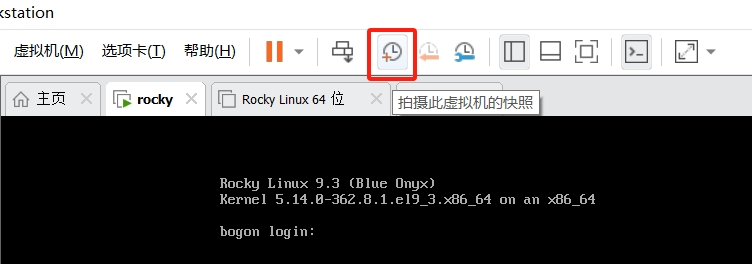

2. 为快照起一个名字，填写描述，然后点击拍摄快照

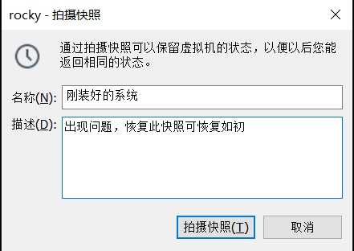

3. 查看拍摄好的系统快照

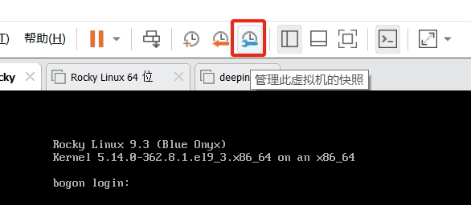

4. 恢复到拍摄快照时的状态

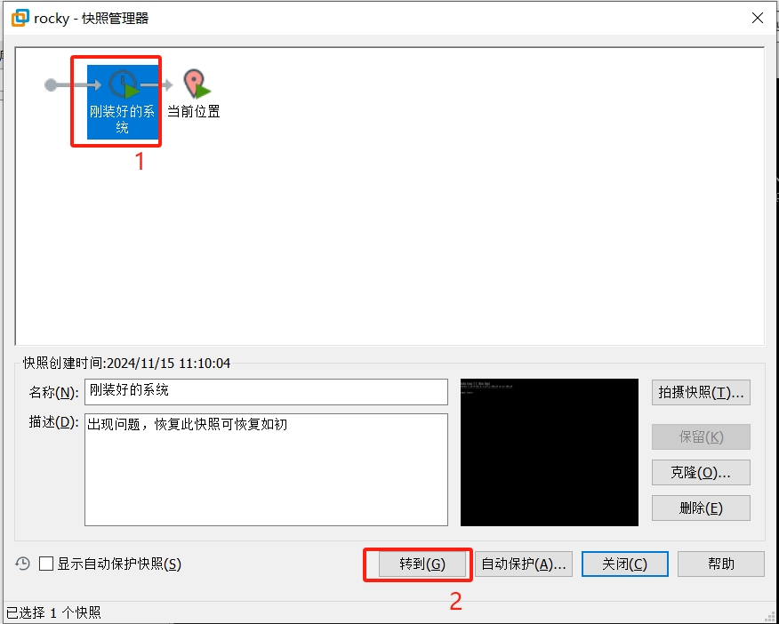

在拍摄好快照之后就可以开始下面的内容了

基础网络配置
----------------
当你通过 :ref:`remote_linux` 后，安装在虚拟机中的Linux系统已经有了访问网络的能力，\
这是在安装系统时系统自动配置好的，在这个过程中也生成了一个配置文件，称之为NIC（Network Interface Controller），
它专门用来控制系统的网络访问行为方式。

如果跟随教程操作失误，导致Xshell无法连接虚拟机中的Rocky Linux，直接直接恢复快照从新来过。

通过nmcli配置网络访问
^^^^^^^^^^^^^^^^^^^^^^^^^^^^

列出系统中已经存在的网络连接配置
""""""""""""""""""""""""""""""""""

.. code-block:: shell

    nmcli connection show

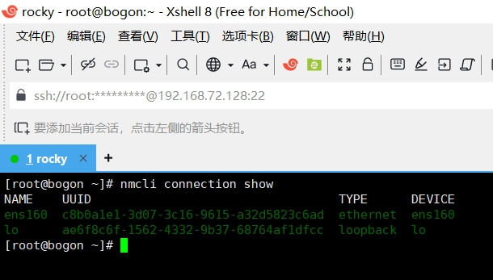

上图中的ens160便是系统中已存在的默认网络连接配置，而lo是一个特殊的 `回路网络接口`_ 配置。

.. _回路网络接口: https://baike.baidu.com/item/localhost/2608730

查看NIC的具体配置
""""""""""""""""""""

.. code-block:: shell

    nmcli connection show ens160

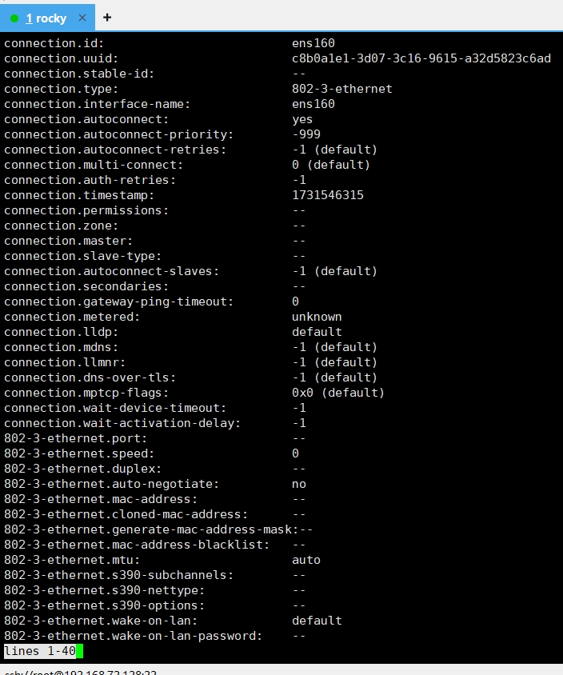

此时可以按键盘上的方向键，通过上下键查看，NIC中有非常多的参数，不过大多数参数并不需要\
我们去理解，这些参数都是系统在自动控制，按键盘上的Q键（意为quit）可退出该界面。我们要着重看一下以下参数：

.. note:: 

    每个人的电脑情况不同，以下命令的执行结果不一定与本教程相同，这不代表你的结果就是错误的，\
    可能你获取到的IP地址与本教程不同。

.. code-block:: shell

    nmcli -f ipv4.method,IP4 connection show ens160

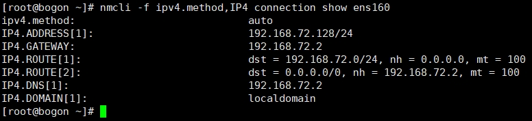

上图就是操作系统中关于 `IP地址`_ 的关键信息，显示的是本机中 `IPv4`_ 地址的信息。

.. _IP地址: https://baike.baidu.com/item/IP%E5%9C%B0%E5%9D%80
.. _IPv4: https://baike.baidu.com/item/IPV4/422599

===================   ====================   ======================
参数名                        值                    意义
===================   ====================   ======================
ipv4.method                   auto                  `DHCP`_
IP4.ADDRESS             192.168.72.128/24          `C类IP地址`_
IP4.GATEWAY             192.168.72.2                `网关`_
IP4.ROUTE                 dst = 192...              `路由`_
IP4.DNS                   192.168.72.2              `DNS`_
IP4.DOMAIN                localdomain               `域名`_
===================   ====================   ======================

.. _DHCP: https://baike.baidu.com/item/%E5%8A%A8%E6%80%81%E4%B8%BB%E6%9C%BA%E9%85%8D%E7%BD%AE%E5%8D%8F%E8%AE%AE
.. _C类IP地址: https://baike.baidu.com/item/C%E7%B1%BB%E5%9C%B0%E5%9D%80
.. _网关: https://baike.baidu.com/item/%E7%BD%91%E5%85%B3
.. _路由: https://baike.baidu.com/item/%E8%B7%AF%E7%94%B1/363497
.. _DNS: https://baike.baidu.com/item/%E5%9F%9F%E5%90%8D%E7%B3%BB%E7%BB%9F
.. _域名: https://baike.baidu.com/item/%E5%9F%9F%E5%90%8D

.. hint:: 

    ``nmcli -f ipv4.method,IP4 connection show ens160`` 输出了特定内容，这是为何？\
    这是因为nmcli的参数决定的，要想理解参数非常容易。

    Linux系统中的所有命令都有帮助信息，比如在命令行中输入 ``nmcli --help`` ：

    .. image:: ../images/sysAdmin/1-4.png
        :align: center

    然后再输入 ``nmcli c help`` 了解connection的用法（没错，connection可以简写为c）：

    .. image:: ../images/sysAdmin/1-5.png
        :align: center

    这样我们就了解到 ``nmcli -f ipv4.method,IP4 c show ens160`` 的作用了：

      * -f：指定输出的字段，我们指定了ipv4.method和IP4
      * c：代表connection，我们想查看网络连接的内容
      * show：展示需要查看的内容
      * ens160：是安装好系统后默认的网络连接NIC名称

    Linux中有大量命令，不需要死记硬背，不会使用直接 **--help** 一般就可以得到使用指南，\
    探索未知的事物也不失为一种乐趣。

为ens160配置静态地址
""""""""""""""""""""""""""

刚刚查到，ens160的ipv4.method是auto属性，它是DHCP的动态IP地址，某些情况下会导致主机的地\
址来回变化。那如果我们希望主机一直使用一个固定IP怎么办？这时就可以给它设置一个 `静态IP地址`_ ：

.. _静态IP地址: https://baike.baidu.com/item/%E9%9D%99%E6%80%81IP

.. warning:: 

    本小节操作稍有不慎，极易导致xshell失去与虚拟机中的Rocky Linux的连接，所以在开始之前\
    做好快照。如果xshell没有任何反应，就说明已经与虚拟机中的系统失去连接，哪里的步骤操作\
    有问题，可恢复快照后重新开始。

    恢复快照会将之前的所有操作抹去，恢复成拍摄快照时的状态。

.. code-block:: shell

    nmcli c modify ens160 ipv4.method manual ipv4.address 192.168.72.138/24 ipv4.gateway 192.168.72.2 ipv4.dns 192.168.72.2 ipv4.dns-search 192.168.72.2

**参数说明：**
  
  * 执行 ``nmcli c help`` 可知modify可用来修改网络连接配置，我们修改的目标为ens160
  * ipv4.method manual 将会改为手动，也就是静态地址（Static IP），此时主机将不会再自动获取IP地址
  * ipv4.address 192.168.72.138/24 为虚拟机指定的地址，通过 ``nmcli -f ipv4.method,ip4 c show ens160`` 查到的IP.ADDRESS加10，以你的实际情况为准
  * ipv4.gateway 192.168.72.2 为虚拟机指定的网关地址，通过 ``nmcli -f ipv4.method,ip4 c show ens160`` 查到的IP.GATEWAY，网关在一个网络中一般只有一个，这个我们保持不变
  * ipv4.dns 192.168.72.2 为虚拟机指定DNS地址，通过 ``nmcli -f ipv4.method,ip4 c show ens160`` 查到的IP.DNS
  * ipv4.dns-search 192.168.72.2 同DNS即可

执行完上面的命令后，网络配置并没有生效，还需要执行以下的命令激活我们配好的配置：

.. code-block:: shell

    nmcli c up ens160

执行完此命令后，xshell会立即失去响应，没多久会显示连接断开

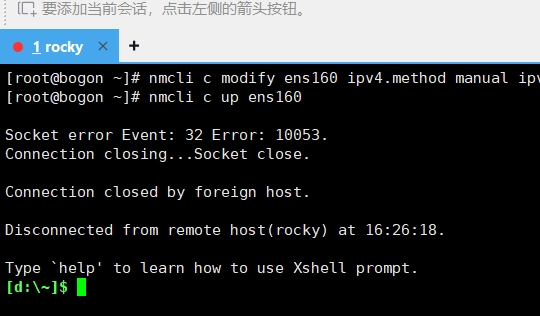

这是正常的，因为我们改变了虚拟机的IP地址，需要更新一下Xshell的配置，便可重新连接：

点击文件-打开

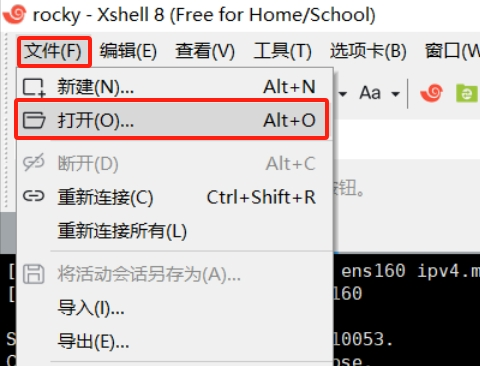

鼠标右键先前配置好的连接，然后选择属性

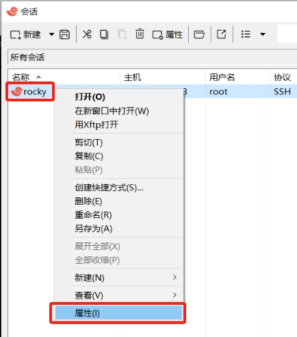

在主机处更新刚刚配置好的地址：192.168.72.138

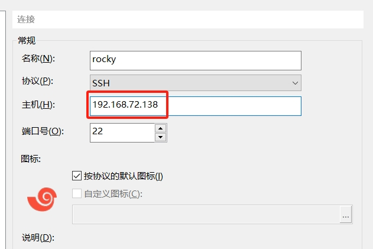

然后点击确定，再点击连接，因为我们用新IP连接虚拟机，需要重新接受并保存主机密钥

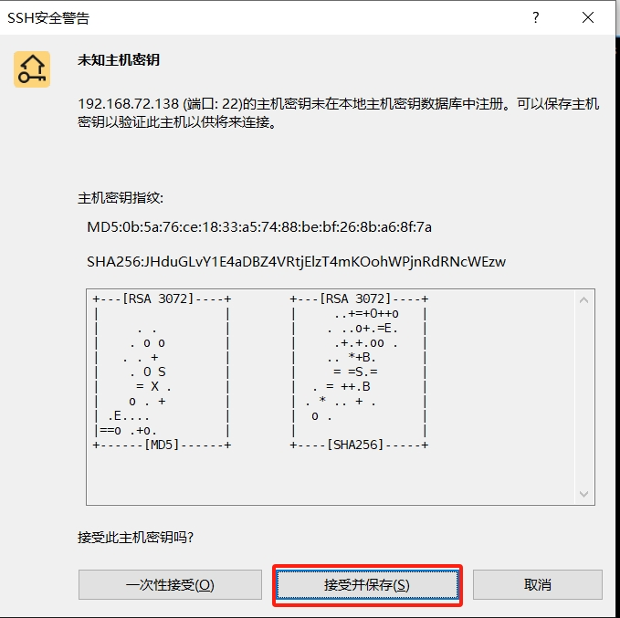

这样我们就通过新的IP成功登录了虚拟机内的系统。

确认配置好的网络配置
""""""""""""""""""""""""""""

显示最新的IP地址： ``ip address show ens160``

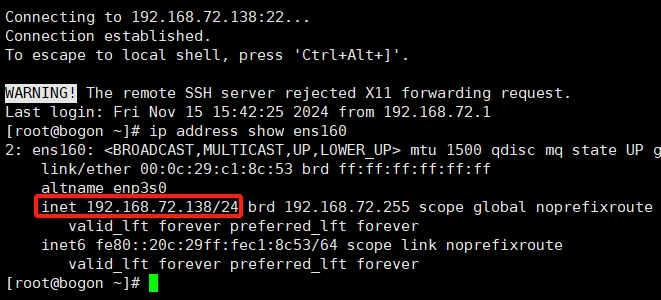

显示网关地址： ``ip route show default`` ，显示DNS地址： ``cat /etc/resolv.conf``

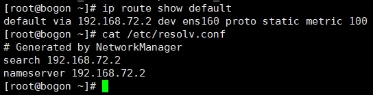

确认DNS功能正常 ``ping baidu.com`` ，可按Ctrl+C键取消：

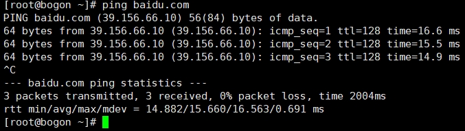

.. hint:: 

    同样此处可以使用 ``ip --help`` 查看该命令的使用方法，以便理解\
    上述命令参数的意义，cat，ping兼可如此

    ip为网络管理的另一个命令，cat是查看文件内容的命令，ping为测试网络连通性的命令

    

如上，如果你的配置没有问题，那此次修改静态地址的行动便成功了，你已有了初步管理Linux系统网络\
的能力。

通过nmtui配置网络
^^^^^^^^^^^^^^^^^^^^
通过nmcli配置网络真是太痛苦了，有没有简便一点的方式？当然有，它就是nmtui！直接在\
命令行中输入nmtui，它会出现一个 `TUI界面`_ （Text-based User Interface）

.. _TUI界面: https://baike.baidu.com/item/%E6%96%87%E6%9C%AC%E7%94%A8%E6%88%B7%E7%95%8C%E9%9D%A2/481482

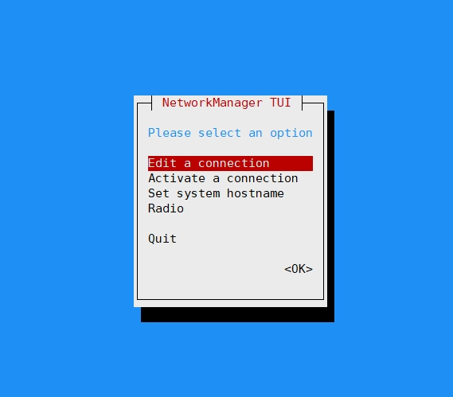

.. important:: 

    在TUI中注意：

      * 方向键可上下选择内容
      * 回车键可进入相关菜单或确认选择
      * 空格键可选中或取消选择选择框

刚刚我们使用nmcli将系统配置为静态IP地址，现在来使用nmtui将系统改回DHCP获取IP地址：

1. 按键盘方向键上下键，选中Edit a connection，然后按下回车键
2. 光标此时处于ens160上，直接按下回车键

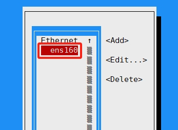

3. 选中IPv4 CONFIGURATION的Manual，回车选择Automatic，然后删除address，DNS，search domains配置：

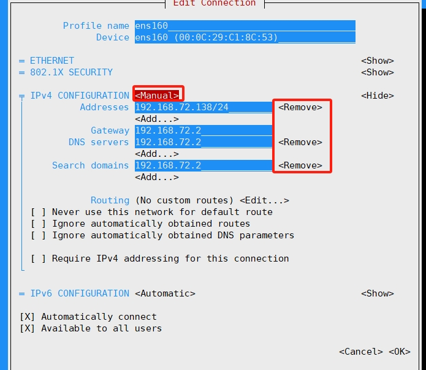

4. 移动下面的OK，回车保存配置

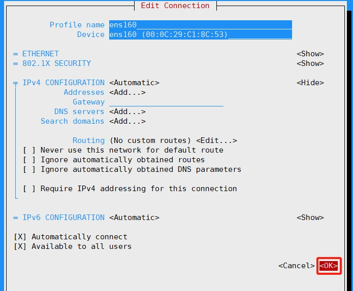

5. 选中Back，返回

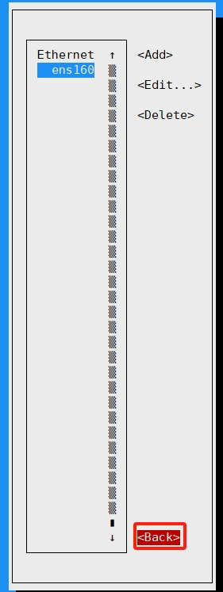

6. 选中Quit，按下回车键后，将会退出nmtui

此时配置修改完成，但没有生效，还需要执行 ``nmcli c up ens160`` 来使配置生效。因为\
改为DHCP，此时系统将会重新获取IP地址，xshell将再次失去连接，需要去VMware中查看最新的\
IP地址是什么：

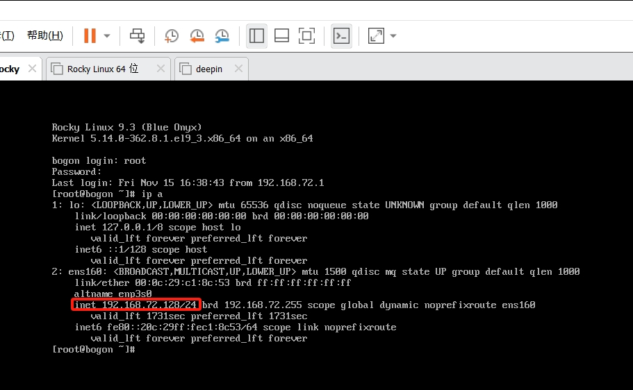

将查到的IP地址，重新在xshell中配置好，便可恢复xshell的远程访问。

学完以上内容，你已掌握了Linux基本的网络配置方法。
