用户与权限管理
========================
Linux系统也是一个多用户操作系统 [#f1]_。在多人使用的场景下，就有可能出现权限问题：\
如一个文件只允许某个用户查看，另一个用户不允许查看；系统设置只允许管理员进行操作，\
其它用户不允许操作等等。

用户与用户组
-----------------------------
用户与用户组的管理是Linux系统管理的核心任务之一，Linux系统上有大量不同的用户与\
用户组，而系统内的程序也是以某个用户的身份运行的，所以用户管理相关工作不止止是管理\
“人”的账户。

用户与用户组的概念
^^^^^^^^^^^^^^^^^^^^^^^
我们先在系统上创建一个文件，以此为支点了解Linux系统上的用户与用户组是什么样的：

.. code-block:: shell

    touch test_file
    ls -l

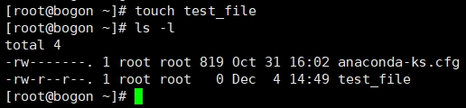

``touch`` 命令是用来更新文件的创建时间、修改时间等信息的，此处被用来创建一个空的文件。\
``ls -l`` 列出了文件的详细内容（可通过 ``ls --help`` 查询ls命令的所有参数），通过这些\
内容来了解Linux系统的用户和用户组概念。

``ls -l`` 依次列出了以下内容（以test_file为例）：

  * ``-rw-r--r--.``：一共10位字符，第一位表示文件类型， **-** 表示普通文件；后九位每三位为一组，第一组为用户权限，\
    第二组为用户组权限，第三组为其它用户权限，rwx分别表示读、写和执行权限。 **.** 表示文件受SELinux\
    控制。
  * ``1 root root   0``：`硬链接`_ 数量、用户名、用户组名及文件大小。
  * ``Dec  4 14:49 test_file``：文件修改时间和文件名。

.. _硬链接: https://baike.baidu.com/item/%E7%A1%AC%E9%93%BE%E6%8E%A5

``ls -l`` 的更多信息可参考 `官方文档`_。

.. _官方文档: https://www.gnu.org/software/coreutils/manual/html_node/What-information-is-listed.html#index-_002dl-7

通过 ``test_file`` 文件创建，可以了解到，Linux的用户权限有三个类别，分别是属主（owner）、属组（group owner）和其它用户（other users）；\
使用权限也有三个，分别是读（r/read）、写（w/write）和执行（x/execute）；还有一个额外的安全控制权限（security context） `SELinux`_。它们共\
同构成了Linux系统权限控制。

.. _SELinux: https://baike.baidu.com/item/SELinux

而用户和用户组都拥有系统中唯一标识的ID，分别是UID（user ID）和GID（group ID）。执行 ``id`` 命令\
可以查看当前用户和用户所在的用户组：

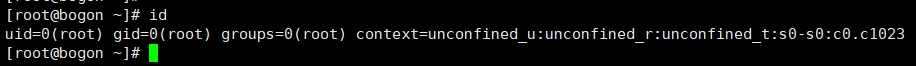

context是SELinux的标识。

一个组内可以有多个用户，如果一个文件的属组权限是该组，该组内的用户则共享读、写和执行权限。

**以上概念或许苍白无力，一时难以理解，不要紧的，随着对Linux系统的深入，\
这些概念之后会自然理解。**

保留用户与用户组的配置修改
^^^^^^^^^^^^^^^^^^^^^^^^^^
系统为系统用户和组保留了1000以下的ID，这些保留的ID可以通过下面的命令查看：

.. code-block:: shell

  cat /usr/share/doc/setup/uidgid

因此新用户与用户组的创建在分配ID时，会从1000开始。红帽推荐ID分配从5000开始，\
可以通过修改 ``/etc/login.defs`` 来达成此目的：

1. 使用nano打开这个配置文件：``nano /etc/login.defs``
2. 按键盘中的方向键的↓键，找到UID_MIN的配置：

.. code-block:: linux-config

  # Min/max values for automatic uid selection in useradd(8)
  #
  UID_MIN                  1000

3. 将UID_MIN的值更改为5000

.. code-block:: linux-config

  # Min/max values for automatic uid selection in useradd(8)
  #
  UID_MIN                  5000

3. 继续按↓键打到GID_MIN的配置

.. code-block:: linux-config

  # Min/max values for automatic gid selection in groupadd(8)
  #
  GID_MIN                  1000

4. 将GID_MIN的值更改为5000

.. code-block:: linux-config

  # Min/max values for automatic gid selection in groupadd(8)
  #
  GID_MIN                  5000

5. 按下Ctrl+X键退出编辑，输入Y保存修改，然后按下回车键保存到文件中

之后在新建用户与用户组时，系统会为它们分配5000之后的ID

.. warning:: 

  ``/etc/login.defs`` 中的其它配置项在不理解的情况下不要随意修改，该文件是系统配置\
  文件，随意修改可能会导致系统产生意外问题。

用户私有组
^^^^^^^^^^^^^^^^^^^^
在组管理上，系统使用了一种叫用户私有组（user private group，UPG）的配置：即在某个用户\
创建时，会同时创建一个与该用户名同名的组名，这个组内只有该用户。如使用 ``id`` 查看当前登录\
的用户与组信息时，可以看到用户名和组名都是 **root**。

UPG的配置会让权限管理更方便更安全：某个用户创建了一个文件，UPG会设定好一个默认权限（如\
上面的test_file的例子），该用户与组内用户都可以访问修改这个文件，其它用户无法访问修改；另一个用户如果想访问\
修改这个文件，直接把他加入到此用户组中即可。

系统上所有的用户组可通过 ``cat /etc/group`` 查看。

.. note:: 

  系统运行时，有很多系统服务也在后台同时运行，因此通过 ``cat /etc/group`` 查看系统上的用户组\
  时，会有很多用户组，而我们从未创建过它们，这些用户组是在操作系统安装过程中创建的且由系统服务使用。

用户账号及用户组的权限管理
--------------------------------
用户账号分为以下类型:

* **普通用户（Normal user accounts）**
  
  可以被创建，修改和删除的常规账号

* **系统用户（System user accounts）**

  系统用户在系统上对应着一个系统服务，这类用户只有在软件安装时创建，之后不会进行修改。

  系统用户的UID为1000以下，常规用户的UID从1000开始，不过我们通过 ``/etc/login.defs`` \
  修改为从5000开始，这也是红帽推荐的配置修改。

.. warning:: 

  系统用户一般只配置本机可用，不允许远程登录，否则可能会导致系统服务出问题。

* **组（group）**

  组是多个用户集合在一起的单元，用来达到某些特殊目的。比如将一个文件的读写权限赋予\
  给某个组，那这个组内的所有用户都可以对这个文件进行读写。

通过命令行创建用户
^^^^^^^^^^^^^^^^^^^^^^^^^^^^^^^^^^^^^^
创建一个test用户并为其设置密码：

* 创建test用户

  .. code:: shell

    useradd test

* 查看创建好的test用户

  .. code:: shell

    id test

  该用户是系统上第一个创建的常规用户，它的uid及gid都应该是5000。

* 为test的用户设置密码

  .. code:: shell

    passwd test

  passwd会提示输入两次密码，这两次密码要保持一致，当提示 ``passwd: all authentication tokens updated successfully.`` ，\
  说明为test用户设置密码的操作已成功。

* 登录新创建的test用户

  可以在vmware中直接登录刚刚创建好的test用户，如果此前已登录了系统，可先执行 ``exit`` 命令退出。

  .. image:: ../images/sysAdmin/2-26.png
    :align: center
  
以上便是创建新用户test的过程，是不是非常简单？

创建用户组
^^^^^^^^^^^^^^^^^^^^^^
创建一个用户组：

* 创建group_test用户组：

  .. code:: shell

    groupadd group_test

* 确认group_test用户组创建结果：

  .. code:: shell

    tail /etc/group

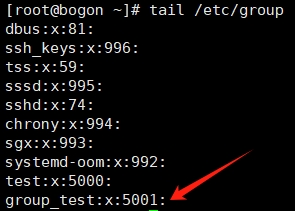

.. hint:: 

  通过 ``man groupadd`` 了解groupadd的更多信息

  通过 ``man tail`` 了解tail的更多信息

为用户添加附加组
^^^^^^^^^^^^^^^^^^^^^^^^
将用户添加到附加组中可以管理用户的访问权限

* 将test用户添加到group_test用户组中：

  .. code:: shell

    usermod --append -G group_test test

* 确认test用户已加入到group_test组中：

  .. code:: shell

    groups test

.. hint:: 

  通过 ``man usermod`` 和 ``man groups`` 了解它们的作用

创建group_test的文件夹
^^^^^^^^^^^^^^^^^^^^^^^^^^^^^^^
前面我们提到，文件有 ``-rw-r--r--`` 十位权限字符，从第二个开始，每三位为一组，分别分别表示\
用户、用户组、其它用户这三种权限。在UPG系统的配置下，通过设置用户组权限（setgid: set-group identification permission ）\
来实现多用户对某个文件夹的权限控制，将这个文件夹授权给别个用户组，同属于这个用户组的多个用户\
都可以这个访问这个特定的文件夹，文件夹内的文件也将继承这些权限。

接下来我们将实现这个功能

* 创建文件夹

  .. code:: shell

    mkdir /opt/share_dir
    # 查看创建好的文件夹
    ls -dl /opt/share_dir

* 将创建好的group_test组与这个文件夹关联

  .. code:: shell

    chgrp group_test /opt/share_dir/
    # 再次查看创建好的文件夹，比对之前的权限区别
    ls -dl /opt/share_dir

* 增加写（write）权限

  .. code:: shell

    chmod g+rwxs,o-rx /opt/share_dir/
    # 查看权限变化
    ls -dl /opt/share_dir

对比 ``/opt/share_dir`` 最初的权限和最新的权限变化：

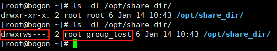

.. hint:: 

  ``#`` 开头的内容为注释说明文字，命令行不会执行相关内容。

  mkdir是用来创建文件夹的命令，意为“make directories”。

  ls命令中的d参数是用来列出文件夹的信息，ls默认只列出文件。

  chgrp是改变文件属组的命令，意为“change group ownership”。

  chmod是改变文件权限的命令，参数说明如下:

  * +号用来增加权限，-号用来取消权限
  * u表示user，g表示group，o表示other users，a表示all users
  * r表示read，w表示write，x表示execute（主要用于文件夹的权限，无此权限无法进入文件夹），\
    s也表示execute权限（用于用户或用户组）
  * 权限也可用数字来表示，read（4）write（2）execute（1）来分别表示，如用户权限是读和执行，则权限为5（读和执行相加）。\
    可以一次设置用户、用户组和其它用户三组权限，如 ``chmod u+rwx,g+rwx /opt/share_dir`` 可写作\
    ``chmod 770 /opt/share_dir``，每一个数字代表一组权限。
  
  以上命令可通过 ``man`` 命令来了解学习更多内容

验证share_dir的权限是否生效
^^^^^^^^^^^^^^^^^^^^^^^^^^^^^^^^^
作为对比，我们再创建一个用户，这个用户不加入 ``group_test`` 用户组来访问 ``share_dir`` 文件夹。

.. code:: shell

  # 添加用户test1
  useradd test1
  # 为用户test1设置密码
  passwd test1

xshell可以复制当前会话，这样我们就可以有两个窗口来进行测试，双击会话选项页标题（下图红色部分）即可：

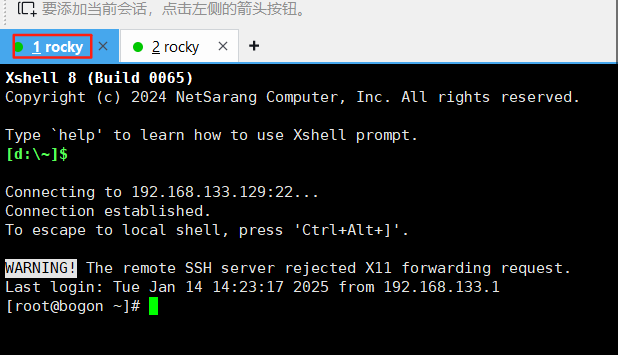

在其中一个窗口执行 ``su - test`` ，另一个窗口执行 ``su - test1`` ，这样就相当于登录了\
这两个测试用户：

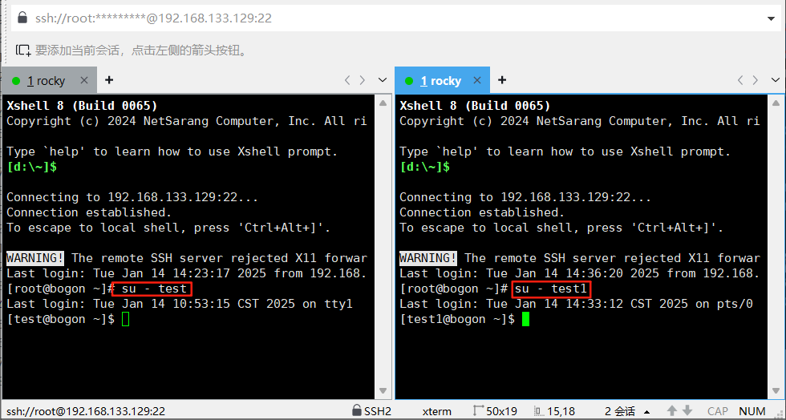

此时，两个用户都执行 ``cd /opt/share_dir`` ，看结果如何：

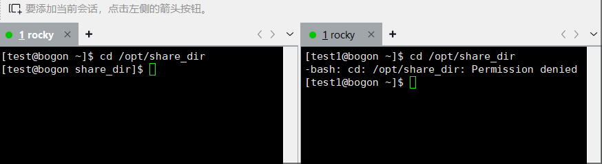

.. hint:: 

  ``@`` 前为用户名，后为主机名，因此在执行su命令后， ``@`` 前的用户名变了。
  
  su命令用来以另一个用户的身份执行命令，此处可以用来切换用户，通过 ``man su`` 了解多更信息。

  cd命令用来跳转文件夹，意为“Change directory”。

可以看到 ``test1`` 用户因为不在 ``group_test`` 的用户组中，在访问属于 ``group_test`` 的\
文件夹时，提示 ``Permission denied`` ，也就是没有权限（此处测试x权限）。

两个用户都执行创建文件的命令 ``touch /opt/share_dir/test_file``，看结果如何（此处测试w权限）：

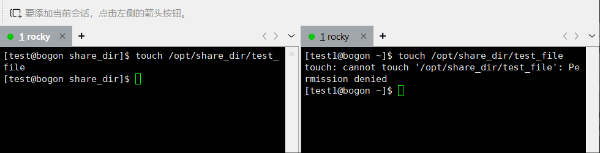

两个用户都执行 ``cat /opt/share_dir/test_file`` ，看结果如何（此处测试r权限）：

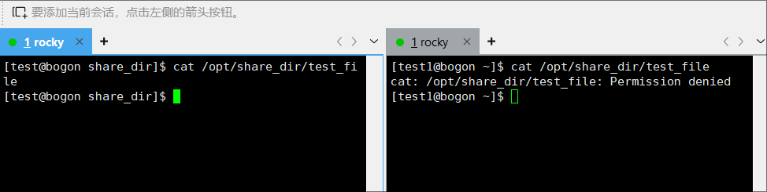

可以看到，在其它用户权限为 ``---`` 时，test1用户没有任何访问 ``/opt/share_dir`` 的权限，这就是UPG系统的作用，用户可以通过加入特别的用户组中，获得特别的权限。

.. important:: 
  在各个窗口中执行 ``exit`` 可以切回到root用户，后续的内容均需要root用户来操作。通过 ``su`` 命令切换\
  到某个用户进行测试后，记得及时切回到root用户。

  ``root`` 用户是超级管理员，是linux系统上权限最大的用户，它可以执行任何操作，而\
  普通用户则受到权限限制，不能执行管理命令，如 ``useradd`` 、 ``usermod`` 等。

用户组的修改
-------------------
同属于一个用户组的用户，拥有相同的文件和文件夹的访问权限，因此修改用户组可以用来改变\
用户的权限。

主要用户组和附加用户组
^^^^^^^^^^^^^^^^^^^^^^^^^^
用户组是由多个用户组成，为了共同的管理目的而组成的单元，如授权访问一个特定文件。

在Linux系统中，用户组主要分为两种：主要用户组（primary group）和附加用户组（Supplementary group）。\
它们有如下属性：

**主要用户组**

* 所有用户有且只有一个主要用户组。
* 主要用户组可以被修改。

**附加用户组**

* 多个用户可以被同时添加到一个附加用户组中，这些用户出于相同的访问权限控制目的。
* 附加用户组的成员数量可以为0；一个用户也可以同时属于多个附加用户组。

查看主要用户组和附加用户组
^^^^^^^^^^^^^^^^^^^^^^^^^^^^^^^
主要用户组和附加用户组都可以通过 ``groups`` 来查看：

* 如查看test用户的主要用户组与附加用户组的情况：

  .. code:: shell

    groups test
    
  .. hint:: 

    输出结果为 ``test : test group_test`` ，第一个test就是主要用户组，而 ``group_test`` \
    则是附加用户组，无论输出多少用户组，第一个永远是该用户的主要用户组，后面的都是附加\
    用户组。

* 如查看test1的用户组情况：

  .. code:: shell

    groups test1

  因为test1用户并没有加入任何其它用户组中，因此它只输出 ``test1`` 这一个主要用户组。

如果 ``groups`` 命令不加任何参数，它则会输出当前登录用户的主要用户组和附加用户组，当前\
用户就是 ``@`` 符号前显示的名字。

更改用户的主要用户组
^^^^^^^^^^^^^^^^^^^^^^^^^^^
将用户的主要用户组修改到另一个已存在的用户组中，可以通过 ``usermod`` 命令来实现：

.. code:: shell

  # 将test1用户的主要用户组修改为test
  usermod -g test test1

修改完成后，用户的家目录的用户组属主也会随之更新：

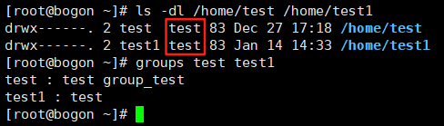
  
将用户添加到附加用户组中
^^^^^^^^^^^^^^^^^^^^^^^^^^^^
将用户添加到附加用户组中，可以管理用户的访问权限，如上面的 ``/opt/share_dir`` 文件夹，\
只有属于 ``group_test`` 用户组的用户才能访问。

所以test用户可以访问，而test1用户不能访问，将test1用户添加到 ``group_test`` 用户组中，\
以便让test1用户也可以访问 ``/opt/share_dir`` 文件夹。

.. code:: shell

  usermod -a -G group_test test1

此时，通过 ``su - test1`` 切换到test1用户，再次通过 ``cd /opt/share_dir`` 访问该文件夹，\
看是否可以访问。

将用户从附加用户组中删除
^^^^^^^^^^^^^^^^^^^^^^^^^
将用户从附加用户组中删除，可以撤销用户的访问权限，如刚刚加入 ``group_test`` 用户组的\
test1用户，将它从 ``group_test`` 用户组中删除，它就不能再访问 ``/opt/share_dir`` 了。

.. code:: shell

  gpasswd -d test1 group_test
  # 查看test1的用户组信息，此时它已不属于group_test用户组
  groups test1

test1此时已无访问 ``/opt/share_dir`` 的权限：

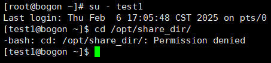

.. hint:: 

  gpasswd命令是用来管理用户组的命令，通过 ``man gpasswd`` 了解更多信息。

更改用户的所有附加组
^^^^^^^^^^^^^^^^^^^^^^^^^^^^
用户可以属于多个不用的用户组，这些用户组可以一次性修改完成。

一性次为test1用户添加多个附加用户组，每个用户组用逗号隔开：

.. code:: shell

  usermod -G test1,group_test,wheel test1

查看test1用户的用户组信息：

.. code:: shell

  groups test1

此时，test1用户已经有 ``wheel group_test test1`` 三个附加用户组了。

usermod在统一增加附加用户组时，未被提及的用户组将被删除：

.. code:: shell

  # 去掉wheel，usermod将会删除wheel用户组，保留test1和group_test用户组
  usermod -G test1,group_test test1

利用这个特性，usermod可以更方便的管理用户的多个附加组，以此来更灵活的管理用户权限。

更改及重置root密码
-------------------------
root用户是Linux系统中权限最大的用户，它的密码安全性十分重要，更改和重置root密码\
也是系统管理的重要任务之一。

.. hint:: 

  为防止误操作，导致安装好的系统无法使用，在操作前通过vmware的快照功能，创建一个\
  快照，以便在操作失误时恢复到操作前的状态。

更改root密码
^^^^^^^^^^^^^^^^^^^^^^^^
更改root密码，可以直接通过 ``passwd`` 来实现，注意当前执行命令的用户为root：

.. code:: shell

  passwd

根据命令提示，输入两次相同的密码，即可更改成功。

``passwd`` 还有一个非常有用的参数，可以一行命令完成密码的更改：

.. code:: shell

  echo "new_password" | passwd --stdin root

.. hint:: 

  echo和passwd是两个命令，上述命令是将echo的输出结果给到passwd命令作为的输入；\
  中间的 ``|`` 被称为管道符，它可以将两个命令结合起来，将前一个命令的输出作为后\
  一个命令的输入。

执行完这行命令后，root密码就直接改为 ``new_password`` 了，不需要输入两次密码，\
将 ``root`` 换成其它用户名，如 ``test`` ，也可以直接更改对应的用户密码。

.. _non_root:

非root用户身份下更改root密码
^^^^^^^^^^^^^^^^^^^^^^^^^^^^^^^^^^^^
假使root密码忘记了，这时候系统上其它的管理用户还可以正常登录，则可以通过这些管理\
用户来更改或重置root密码。

之前建的 ``test`` 及 ``test1`` 用户都是普通用户，它们连 ``usermod`` 这种管理\
命令都无法执行，因此需要把其中一个用户提升为管理用户，以便本小节的实验继续进行。

系统上有一个特殊的用户组 ``wheel`` ，这个用户组就是管理员用户组，任何用户只要加入\
到这个用户组中，摇身一变就成了管理员了。接下来我们将 ``test`` 用户加入到 ``wheel`` \
用户组中，使之成为管理员。

.. code:: shell

  usermod -a -G wheel test

此时 ``test`` 用户已经成为管理员了，恰巧root密码忘记了，无法登录，这时便可以通过 \
``test`` 用户来为root用户重置密码。

.. code:: shell
  
  # 假使root用户忘记密码无法登录，su模拟test用户登录系统
  su - test
  # sudo命令的作用是以其它用户的身份执行命令，此处是以root用户的身份执行passwd命令
  sudo passwd root

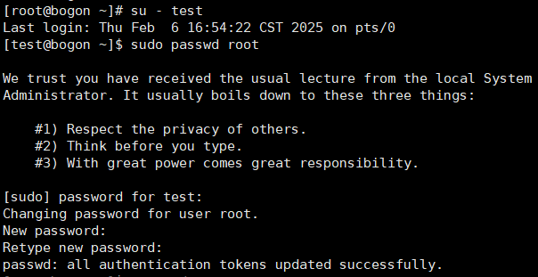

这里提示首先输入一次test用户的密码，然后再输入两次密码便可为root用户重置密码。

.. hint:: 

  虽然 ``test`` 是管理员用户，但执行某些管理命令（如 ``passwd``）时，还是需要\
  通过 ``sudo`` 命令以 ``root`` 身份来执行，这是和windows系统管理员不同的地方。

在 ``boot`` 中重置root密码
^^^^^^^^^^^^^^^^^^^^^^^^^^^^^^^^^^^^
在假设一种极端情况，root密码忘记了无法登录，其它管理员用户也无法登录，系统中又有\
重要数据，不能通过重装系统来恢复，怎么办？

这时候就可以通过 ``boot`` 进入一个特殊环境 `chroot jail`_ 中进行root密码的重置：
简单来讲，按下电源键（vmware中是按下虚拟机中的启动按钮）到系统启动完成这一过程，称\
之为 ``boot`` ，正常情况下它会进入正常的操作系统环境中，只不过我们在 ``boot`` 过\
程中人工介入，让它进入一个 ``chroot jail`` 的环境中，用来重置root密码。

.. _chroot jail: https://www.redhat.com/en/blog/deeper-linux-chroot-jails

.. important:: 

  此小节操作稍有误，极易导致安装好的虚拟机系统无法使用，操作前请先创建一个快照，以便\
  在操作失误时，恢复到失误前的正常状态。

1. 打开vmware，停留在操作界面，在xshell中在root用户下执行 ``reboot`` 命令，\
   使系统重启，同时盯紧vmware界面，如下图：

   .. image:: ../images/sysAdmin/2-37.png
    :align: center

2. 当虚拟机屏幕出现以下图像时，迅速用鼠标左右点击屏幕，同时按下键盘上的 ``E`` 键：
   
   .. image:: ../images/sysAdmin/2-38.png
    :align: center

3. 如上述步骤操作成功，你将进入内核启动参数（kernel boot parameters）界面：

   .. image:: ../images/sysAdmin/2-39.png
    :align: center

4. 按键盘上的方向键，可以上下左右移动光标，将光标移动到以 ``linux`` 开头的行上：
   
   .. image:: ../images/sysAdmin/2-40.png
    :align: center

   按下[Ctrl+E]键，光标将移动到行尾，在此处输入 ``rd.break`` ，注意前面有空格：

   .. image:: ../images/sysAdmin/2-41.png
    :align: center
   
   .. hint:: 

    ``linux`` 开头的行尾是 ``\`` ，其实它与下一行是连在一起的，被当作一行处理，\
    所以当按下[Ctrl+E]键（该快捷键的作用是将光标移动到行尾）后，光标会移动\
    到 ``/swap`` 处，也就是说 ``linxu`` 至 ``/swap`` 这三行其实是一行，而 ``\`` 是\
    将这一行在屏幕中分割成了三行而已。

5. 按下[Ctrl+X]键，系统将以更改后的内核启动参数启动系统，启动完成后将出现 ``switch_root`` \
   的提示：

   .. image:: ../images/sysAdmin/2-42.png
    :align: center

6. 此时系统是只读模式，挂载在 ``/sysroot`` 目录上，无法更改密码，还需要重新挂载一下，使系统进入可写的模式：
   
   .. code:: shell

    mount -o remount,rw /sysroot

7. 执行以下命令，重置root密码：

   .. code:: shell

    # 进入chroot环境
    chroot /sysroot
    # 重置root密码
    passwd
    # 让SELinux在下次启动时重新打标签
    touch /.autorelabel
    # 退出chroot环境
    exit
    # 退出switch_root
    exit

   .. image:: ../images/sysAdmin/2-43.png
    :align: center

   此时SELinux将会启动打标签的进程，当这个进程完成后，系统将会自动重启，重启后\
   就可以使用新密码登录系统了。

.. hint:: 

  mount命令是用来挂载文件系统的命令，后续在文件系统管理中还会涉及。

  chroot命令是用来更改根目录的命令，通过它可以进入一个特殊的环境，用来执行\
  root密码重置等操作。

  根目录是Linux系统中的最顶层目录，所有的文件和文件夹都是从根目录开始的。如\
  ``/opt/share_dir`` ， ``/`` 就是根目录。而 ``chroot`` 命令将根目录更改为\
  ``/sysroot`` ，这样 ``/sysroot`` 就成了根目录，所有的操作都是基于 ``/sysroot`` \
  的。

.. rubric:: 脚注
.. [#f1] 即一个操作系统可同时供多人使用