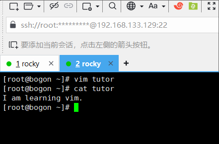

vim文本编辑器
====================
随着对Linux系统的深入，越来越多的配置文件需要我们去修改，也需要我们自己编写脚本去自\
动化完成一些事情（脚本可以简单的理解为命令的堆砌，在熟悉更多的命令之后，后续的教程\
会有编程教学），这时候就需要一个强大的文本编辑器来辅助我们工作，而它就是 ``vim`` 。

vim简介
---------------
``vi`` 是比 ``nano`` 功能性更强大的编辑器，除了编辑文字的基本功能外，还有词、行和\
文字块（指一大段文字）的复制删除，搜索替换指定字符等功能，而 ``vim`` 是 ``vi`` 的\
升级版，功能进一步增强，支持编程语言语法高亮，多窗口编辑，多文件编辑等功能。

vim安装
---------------
由于在安装系统时，使用的是 ``Rocky-9-latest-x86_64-minimal.iso`` 镜像进行安装的，它\
是最小化安装，所以 ``vim`` 并没有安装，需要我们手动安装。

执行以下命令即可进行安装：

.. code:: shell

    dnf install -y vim

vim入门
---------------
功能越强大的工具，往往使用起来也越复杂，不过有一个辅助我们快速入门的命令，那就\
是 ``vimtutor`` 。

``vimtutor`` 默认使用英文进行入门教学，不过它也提供了中文版本的交互教程，执行以下命令\
即可：

.. code:: shell

    vimtutor zh_cn

该教程会带你快速了解 ``vim`` 的基本操作，熟练掌握这些操作后，你就可以开始使用 ``vim``\
进行编辑工作了。

笔者会对这个教程进行辅助说明，帮助你更好的理解 ``vim`` 的使用方法。

.. important:: 

    在 ``vim`` 中，有多种不同的模式，默认进入普通（normal）模式，在 ``vimtutor``\
    互动教程中，可能误按键位进入了其它模式，这时候可以按 ``ESC`` 回到普通模式。

    请确认当时输入法模式是英文输入模式，且没有打开大小写锁定。

    请尝试按下 ``i`` 键，屏幕左下方会出现 ``-- INSERT --`` ，这时候就是进入了插入\
    模式，按下 ``ESC`` 退出插入模式。

    请尝试按下 ``v`` 键，屏幕左下方会出现 ``-- VISUAL --`` ，这时候就是进入了可视\
    模式，按下 ``ESC`` 退出可视模式。

    因此，在 ``vimtutor`` 互动教程中，如果你误按键位进入了其它模式，可以按 ``ESC``\
    退出，教程大部分内容都是在普通模式下进行的，普通模式左下角没有任何文字。

移动光标
^^^^^^^^^^^^^^
请按教程提示，使用对应键位移动光标，``vim`` 中当然也可以使用方向键移动光标，但是\
方向键是远离主键区的，而 ``h`` ``j`` ``k`` ``l`` 是主键区的，这样可以更快的移动\
光标。

请注意在操作时，一定要保证输入法是英文状态且没有打开大小写锁定，操作前可多按几次 ``ESC``\
确保当前是普通模式。

如果对光标的移动没有疑问了，可以将光标移动到下一小节进行学习。

vim的进入和退出
^^^^^^^^^^^^^^^^^^^^
按交互教程提示，执行 ``:q!`` 退出 ``vim``，这个命令是不保存修改内容强制退出，退出\
后使用 ``vimtutor zh_cn`` 重新进入教程，不加 ``zh_cn`` 参数则进入英文教程。

.. note:: 

    你可以把 ``q`` 理解成 **quit** ， ``!`` 理解成 **强制** ，所以 ``:q!`` 就是\
    **强制退出** 。

你可以尝试执行以下内容，理解 ``vim`` 的进入和退出， ``vimtutor`` 仅是教程命令，实际\
上没有对文件进行编辑的能力：

.. code:: shell
   
    # 使用vim编辑系统分区文件
    vim /etc/fstab
    # 退出vim，退出前可按一下ESC键，确保当前是普通模式
    :q!

如果对进入和退出 ``vim`` 没有疑问了，可以将光标移动到下一小节进行学习。

文本编辑之删除
^^^^^^^^^^^^^^^^^^^^
按交互教程提示，使用 ``x`` 删除光标所在字符，最终修正好的句子如下：

是不是感觉比 ``nano`` 更好用了呢？更强大的功能还在后面，接着进入下一小节吧。

文本编辑之插入
^^^^^^^^^^^^^^^^^^^^
插入模式是 ``vim`` 中最常用的模式，按交互教程提示，将教程中的缺失语句补充到与下一行正确\
的语句一致，进入插入模式后，``h`` ``j`` 等移动光标的键位会失效，只能使用方向键移动光标，\
或者按 ``ESC`` 退出插入模式，再使用 ``h`` ``j`` 等移动光标的键位。

.. _append_command:

文本编辑之添加
^^^^^^^^^^^^^^^^^^^^
添加动作与插入动作类似，不过添加动作是在光标所在字符的后面添加字符，这里值得注意的是，\
在普通模式下进入编辑模式，存在以下区别：

- ``i`` 进入插入模式，光标在当前字符上
- ``a`` 进入添加模式，光标在当前字符的后面
- ``A`` 进入添加模式，光标在当前行的行尾
- ``I`` 进入插入模式，光标在当前行的行首

.. note:: 

    - ``i`` 表示 **insert** ，即插入，光标在当前字符上
    - ``a`` 表示 **append** ，即添加，光标在当前字符的后面

    这样来理解这两个字母的含义

因此，进行编辑模式时，按键大小写是有区别的，这里需要注意。

编辑文件
^^^^^^^^^^^^^^
由于 ``vimtutor`` 是一个交互式教程，所以它并没有对文件进行编辑，这一小节需要我们\
在XSHELL中再开一个窗口，进行操作：

.. code:: shell

    # tutor是我们要操作的文件，它并不存在，但vim会自动创建
    vim tutor
    # 按i进入插入模式，随便输入一些内容
    I am learning vim.
    # 按下ESC键退出编辑模式，保存内容并退出vim
    :wq
    # 查看新创建的文件内容
    cat tutor

.. note:: 

    - ``:`` 是进入命令模式的前缀
    - ``w`` 表示 **write** ，即写入
    - ``q`` 表示 **quit** ，即退出
   
    这样就能理解 ``:wq`` 的含义了，即 **write and quit** 。

如果你的操作步骤没有出错，那么你的屏幕输出应该如下：

.. hint:: 

    第一讲内容已经结束，交互教程进行了小结，其实内容非常少，这对于聪明好学的你来说，\
    是不是小菜一碟呢？

    .. image:: ../images/sysAdmin/4_vim/1-4.png
        :align: center

删除类命令
^^^^^^^^^^^^^^
按交互教程提示，使用 ``dw`` 随便删除一些单词，不过这只对英文内容生效，如果对中文\
内容使用，它会删除整个短句，而非单词。好在编程脚本和系统中的配置文件都是英语的，所以\
这个功能对我们来说是非常有用的。

.. note:: 

    - ``d`` 表示 **delete** ，即删除
    - ``w`` 表示 **word** ，即单词

    这样来理解 ``dw`` 的含义。

更多删除类命令
^^^^^^^^^^^^^^^^^^^^
按交互教程提示，使用 ``d$`` 删除到行尾，注意是将光标移动到 ``twice.`` 后的空格处，\
此时使用 ``d$`` 删除到行尾，就只剩下 ``---> Somebody typed the end of this line twice.`` 。

怎么样，是不是比起往常图表界面下鼠标选中删除更加高效呢？

关于命令和对象
^^^^^^^^^^^^^^^^^^^^
此小节罗列了 ``w``，``e``，``$`` 三种动作（motion），此外还有 ``b`` ，``0`` 两种动作，\
请将光标移动到上一小节的英文内容中，尝试这5种动作会有什么效果。

而将这五个动作与 ``d`` 指令结合，就会有更多的功能，比如：

- ``dw`` 从光标处起向右删除一个单词
- ``de`` 从光标处起向右删除到单词末尾（将光标置于单词中间测试， 看和``dw``有何不同）
- ``d$`` 从光标处起删除到行尾
- ``db`` 从光标处起向左删除一个单词
- ``d0`` 从光标处起删除到行首

切记以上组合仅对英文内容生效，对中文内容使用并不会达到预期效果。

.. note:: 

    - ``e`` 表示 **end** ，即末尾
    - ``b`` 表示 **back** ，即反面

    这样来理解 ``e`` 和 ``b`` 的含义。

使用计数指定动作
^^^^^^^^^^^^^^^^^^^^
按交互教程提示，使用 ``2w`` 将光标移动到第二个单词的开头，再使用 ``3e`` 将光标移动到\
第三个单词的末尾，这样就可以快速移动光标到指定位置。

不仅如此，你还可以尝试与上一小节中的 ``b`` 结合使用，可以尝试一下会发生什么。不过\
不要和 ``0``，``$`` 结合使用，因为它们是移动到行首和行尾的，不需要计数。

还有，你可以尝试一下 ``3h`` ， ``4j`` ， ``5k`` ， ``6l`` ，看看会发生什么。

使用计数以删除更多
^^^^^^^^^^^^^^^^^^^^
按交互教程提示，使用 ``2dw`` 删除两个单词，然后探索使用这种方式，将句中的大写单词\
全部删除。

怎么样，这样一来删除功能是不是更加强大灵活了呢？更多组合可以自行尝试，如 ``3db``。

操作整行
^^^^^^^^^^^^^^
按交互教程提示，使用 ``dd`` 删除整行，以及 ``2dd`` 删除两行，这样就可以快速删除多行内容。

学完这几小节的内容，是不是对删除类的操作已经了如指掌了呢？

撤消类命令
^^^^^^^^^^^^^^
按交互教程提示，使用 ``x`` 删除错误的字母，然后按``u`` 撤消上一步操作，\
使用 ``x`` 删除多处错误的字母， 此时按下大写的 ``U`` 可撤消整行操作， \
``Ctrl + r`` 则可以恢复撤消操作，多次按 ``Ctrl + r`` 可以恢复多次撤消操作。

.. note:: 

    - ``u`` 表示 **undo** ，即撤消
    - ``U`` 表示 **undo line** ，即撤消整行
    - ``Ctrl + r`` 表示 **redo** ，即恢复

    这样来理解 ``u`` ， ``U`` ， ``Ctrl + r`` 的含义。

.. hint:: 

    第二讲的内容已结束，阅读第二讲的小结，回顾一下这一讲的内容，到这里你已经掌握了\
    ``vim`` 的基本操作，可以应付日常工作中的文本编辑了。

置入类命令
^^^^^^^^^^^^^^
按交互教程提示，使用 ``dd`` 删除整行，然后使用 ``p`` 粘贴到指定位置，将错误的\
文字顺序调整成正确的，即 **abcd** 的顺序。

.. note:: 

    - ``p`` 表示 **paste** ，即粘贴

    这样来理解 ``p`` 的含义。

文本行删除后，被删除的文本行被保存到了 ``vim`` 的寄存器中，然后可以使用 ``p``\
将其粘贴到指定位置。

`寄存器`_ 位于CPU中，用来暂时存放数据。

.. _寄存器: https://baike.baidu.com/item/%E5%AF%84%E5%AD%98%E5%99%A8

.. _replace_command:

替换类命令
^^^^^^^^^^^^^^
按交互教程提示，使用 ``r`` 替换光标所在字符，将第一行中错误的字符替换成正确的字符，\
使它保持与下一行的语句一致。

发现了吗？``r`` 命令只能替换一个字符，输入替换字符后，自动回到普通模式。而大写的\
``R`` 命令可以替换多个字符，输入替换字符后，会一直处于替换模式，直到按下 ``ESC`` 退出，\
可以自行尝试一下 ``R`` 命令的作用。

.. note:: 

    - ``r`` 表示 **replace** ，即替换

    这样来理解 ``r`` 的含义。

更改类命令
^^^^^^^^^^^^^^
按交互教程提示，使用 ``cw`` 删除光标处到词末尾的字符，并自动进行插入模式，\
输入正确的单词，将错误的单词更改成正确的，然后按 ``ESC`` 退出插入模式，如此以往，\
将整行的错误单词更改成正确的，使它保持与下一行的语句一致。

``cw`` 直接将删除动作和插入动作结合在一起，这样就可以快速更改文本内容。

.. note:: 

    - ``c`` 表示 **change** ，即更改

    这样来理解 ``c`` 的含义。

使用c更改更多
^^^^^^^^^^^^^^^^^^^^
按交互教程提示，使用 ``c$`` 删除光标处到行尾的字符，并自动进行插入模式，\
输入正确的内容，使它保持与下一行的语句一致。

.. hint:: 

    第三讲的内容已结束，阅读第三讲的小结，回顾一下这一讲的内容，你的 ``vim`` 技能\
    更上一层楼了，成为大神已经指日可待了。

定位及文件状态
^^^^^^^^^^^^^^^^^^^^
在按交互教程提示操作前，一定要确认好当前处于普通模式，即按 ``ESC`` 键后所处的模式。

按下 ``Ctrl + g`` 可以查看文件状态，包括文件名，行号，当前行与文件总行数的百分比，\
以及光标所在行的字符顺序号。

如上图所示，文件名为 ``tutortGZCaC``，位于于 ``/tmp`` 目录下，当前行号为499，\
总行数为996，当前位置处于全文中的50%，光标所在行的字符顺序号为3。``vimtutor``\
每次都会在 ``/tmp`` 目录下创建一个新文件，文件名为 ``tutor`` 后面跟着一串随机字符，\
退出 ``vimtutor`` 后，这个文件会被自动删除。

记住 **499** 这个行号，下面会用到。 ``ruler`` 处的内容可暂时忽略，后面会有相关内容介绍。

按下 ``G`` 可以直接跳转到文件末尾，按下 ``gg`` 可以直接跳转到文件开头，按下 ``499G``\
可以直接跳转到第499行，也就是刚刚记住的行号，记得区分大小写，同时要处于普通模式下。

.. note:: 

    - ``g`` 表示 **go** ，即跳转

    这样来理解本小节的相关内容。

搜索类命令
^^^^^^^^^^^^^^
按交互教程提示，使用 ``/`` 进行搜索，输入 ``errroor`` ，然后按下回车键，它会自动\
跳转到第一个匹配的单词，然后按下 ``n`` 可以跳转到下一个匹配的单词，按下 ``N``\
可以跳转到上一个匹配的单词。

``?`` 与 ``/`` 的功能相同，只是搜索方向相反，``Ctrl+o`` （小写字母o）可以跳转到\
上一个位置，``Ctrl+i`` （小写字母i）可以跳转到下一个位置。

当在下文搜索不到 ``errroor`` 时，按下 ``n`` 会提示 ``search hit BOTTOM, continuing at TOP`` ，\
表示下文中已搜索不到匹配文字，将继续从文件头部开始搜索。

配对括号的查找
^^^^^^^^^^^^^^^^^^^^
按交互教程提示，将光标移动到 **(** 上，按下 ``%`` ，它会自动跳转到与之匹配的 **）** 处，\
再按下 ``%`` ，它会跳转回 **(** 处。

这个功能在编程中非常有用，可以快速定位到配对的括号处，这样就可以快速定位到代码块的开始和结束。

替换命令
^^^^^^^^^^^^^^
按交互教程提示，使用 ``:s/thee/the/g`` 进行替换，``g`` 表示全局替换，不加 ``g`` 则只替换\
第一个匹配的单词，``gc`` 表示交互式替换，会提示是否替换。

``:s`` 是替换命令的前缀， ``thee`` 是要被替换的单词， ``the`` 是替换后的单词，\
``g`` 表示全局替换。

还有一种用法是指定范围进行替换： ``:560,574s/thee/the/g``，表示从第560行到第574行进行替换，\
你可以按 ``u`` 撤销刚刚的改动，然后尝试一下这个命令。

.. hint:: 

    第四讲的内容已结束，阅读第四讲的小结，回顾一下这一讲的内容，你已经掌握了 ``vim``\
    的高级操作，是不是感觉自己已经成为 ``vim`` 大神了呢？

在vim内执行外部命令的方法
^^^^^^^^^^^^^^^^^^^^^^^^^^^^^^^^^^^^
按交互教程提示，输入 ``:!ls`` ，然后按下回车键，\
它会显示当前目录下的文件，然后再按回车，可加到 ``vim`` 中。

关于保存文件的更多信息
^^^^^^^^^^^^^^^^^^^^^^^^^^^^^^^^^^^^
按交互教程提示，输入 ``:w`` 保存文件，输入 ``:w TEST`` 保存文件为新文件。\
为了验证这一点，你可以使用 ``:q!`` 退出 ``vim`` ，然后使用 ``vim TEST`` 查看文件内容，\
是否和你保存时的内容一致。

验证完后退出 ``TEST`` 文件，然后再次使用 ``vimtutor zh_cn`` 进入 ``vimtutor`` ，\
然后执行 ``640G`` 回到刚刚的位置附近，执行 ``:!rm TEST`` 删除 ``TEST`` 文件。

.. hint:: 

    rm意为remove，是一个删除命令，可用了删除文件和文件夹，更多信息可参考\
    ``rm --help`` 和 ``man rm``。

一个具有选择性的保存命令
^^^^^^^^^^^^^^^^^^^^^^^^^^^^^^^^^^^^
按交互教程提示，按下 ``v`` 进入可视模式，然后使用 ``j`` ``k`` 移动光标，\
移动到第五个条目上，按下 ``:`` ，然后输入 ``w TEST``，会将选中的内容保存到\
**TEST** 文件中。（按下 ``:`` 后，会出现 ``:'<,'>`` ，不要修改它，直接在它后面\
输入 ``w TEST`` ）

可视模式下选中的文件也可以和其它动作结合，如按下 ``d`` 键会删除选中的内容。

提取和合并文件
^^^^^^^^^^^^^^^^^^^^^^^^^^^^^^^^^^^^
按交互教程提示，使用 ``:r TEST`` 将 **TEST** 文件的内容插入到当前文件中，\
你甚至可以使用 ``:r !ls`` 将 ``ls`` 命令的输出插入到当前文件中。可自行尝试\
一下这两个命令。

如上图中的红色框内的内容，就是通过 ``:r`` （指read）命令插入到当前文件中的内容。

.. hint:: 

    第五讲的内容已结束，阅读第五讲的小结，回顾一下这一讲的内容，你的 ``vim``\
    技能更进一步了。

打开类命令
^^^^^^^^^^^^^^
按交互教程提示，按下 ``o`` 在当前行的下方打开一个新行，然后输入一些内容，\
按下 ``ESC`` 退出插入模式，然后按下 ``O`` 在当前行的上方打开一个新行，\
输入一些内容，按下 ``ESC`` 退出插入模式。

即小写 ``o`` 在光标行的下方打开新行，并进入插入模式，大写 ``O`` 在光标行的上方\
打开新行，并进入插入模式。

附加类命令
^^^^^^^^^^^^^^
这一小节的内容与 :ref:`append_command` 小节中的内容雷同，可自行再次尝试一下。

另外一个置换类命令的版本
^^^^^^^^^^^^^^^^^^^^^^^^^^^^^^
这一小节的内容与 :ref:`replace_command` 小节中的内容雷同，可自行再次尝试一下。

复制粘贴文本
^^^^^^^^^^^^^^
按交互教程提示，按下 ``v`` 进入可视模式，然后移动光标复制指定内容，之后粘贴到指定位置，\
甚至可以使用 ``yw`` 来复制单词，自行尝试一下吧。

设置类命令的选项
^^^^^^^^^^^^^^^^^^^^^^^^^^^^^^
按交互教程提示，输入 ``:set ic`` ， ``:set hls is`` 打开忽略大小写，高亮搜索，\
忽略大小写搜索功能，此时输入 ``/ignore`` 进行搜索，它会忽略大小写进行搜索并进行\
高亮显示。

要关闭相关功能，只需要加上 ``no`` 前缀即可，如 ``:set noic`` ， ``:set nohls`` ，\
 ``:set nois`` 。

.. hint:: 

    第六讲的内容已结束，阅读第六讲的小结，回顾一下这一讲的内容，又增加了不少\
    ``vim`` 的高级操作技能了。

获取帮助信息
^^^^^^^^^^^^^^
``vim`` 安装后自带了帮助文档，按交互教程提示，输入 ``:help`` 可以查看帮助文档，\
按下 ``CTRL+W`` 键可在窗口间来回跳转， ``:q`` 可关闭帮助窗口。

核心使用技巧：

- ``:help user-manual`` 查看用户手册
- 找到需要了解的内容，如 **Moving around** ，那就输入它前面的章节名字：``:help usr_03.txt`` \
  进行查看
- ``:help options.txt`` 可查看所有的选项，如上面提到的 ``ic`` ， ``hls`` ， ``is`` 等选项。
- 查询具体选项的帮助内容，如 ``:help hlsearch`` 或缩写 ``:help hls`` 查看高亮搜索的帮助内容；查询具体\
  的可选参数，如 ``set hls?`` 查看高亮搜索的可选参数。
- 使用 ``CTRL+O`` 可以返回上一个帮助页面， ``CTRL+I`` 可以前进到下一个帮助页面
- 使用 ``CTRL+D`` 可以向下翻半页， ``CTRL+U`` 可以向上翻半页， ``CTRL+B`` 可以向上翻整页，\
  ``CTRL+F`` 可以向下翻整页， ``CTRL+E`` 可以向上滚动一行， ``CTRL+Y`` 可以向下滚动一行，\
  这些快捷键在 ``vim`` 中都是通用的。

创建启动脚本
^^^^^^^^^^^^^^
vim的诸多功能并没有默认开启，不过可以通过配置文件 ``vimrc`` 来设置，开启另一个窗口终端，按交互教程提示，\
在命令行（不是在 ``vimtutor`` 中）输入 ``vim ~/.vimrc`` 按下回车，然后在打开的 ``vim`` 窗口中输入 ``:r $VIMRUNTIME/vimrc_example.vim``，\
它将会读取一个示例配置文件：

.. image:: ../images/sysAdmin/4_vim/1-8.png
    :align: center

接着使用 ``:wq`` 保存并退出，之后 ``vim`` 将自动支持搜索高亮等功能。可通过 ``:help vimrc-intro`` 了解 ``vimrc`` 的更多内容。

.. hint:: 

    ``~`` 是Linux系统环境中的特殊变量，它表示当前用户的家目录。执行以下命令验证：

    .. code:: shell

        cd ~
        # 看一下当前目录
        pwd
        # 切换到test用户
        su - test
        # 执行以下命令
        cd ~
        # 看一下现在在哪个目录
        pwd
    
    你会发现 ``~`` 表示的是当前用户的家目录。所以 ``vim ~/.vimrc`` 在哪儿你知道了嘛？

    而 ``.`` 开头的文件名，是Linux系统中的隐藏文件，使用 ``ls -a ~/`` 就可以看到刚刚的配置文件了。

    ``$VIMRUNTIME`` 是 ``vim`` 的运行时目录，它是一个环境变量，表示 ``vim`` 的运行时目录，\
    Linux系统中遇到以 ``$`` 开头的字符，一般都是变量，因为你可以通过 ``echo $VIMRUNTIME`` 查看它的值：

    .. image:: ../images/sysAdmin/4_vim/1-9.png
        :align: center

    这下知道 ``~/.vimrc`` 中的内容是从哪里来的了吧？

补全功能
^^^^^^^^^^^^^^
``vim`` 中还有命令补齐功能，和命令行中的 ``TAB`` 键补全功能类似，按交互教程提示，\
输入 ``:set nocp`` 关闭兼容模式（在Linux中大多数情况下是关闭着的），然后输入命令的\
一部分，按下 ``Ctrl+d`` 或 ``Tab`` 键，它会自动补全命令。比如输入 ``!ec`` 然后按下\
``Ctrl+d`` 或 ``Tab`` 键，它会自动补全为 ``!echo``。比如输入 ``:help user-m`` ，\
``:help usr_01``，这些都是可以补全的。

在 ``vim`` 中，还有历史记忆功能，按下 ``:`` 后，按 ``Ctrl+p`` 可以向上查找历史命令，\
按 ``Ctrl+n`` 可以向下查找历史命令，这样就可以快速查找到之前输入过的命令。

.. hint:: 

    第七讲的内容已结束，阅读第七讲的小结，回顾一下这一讲的内容，你已经掌握了 ``vim``\
    的知识拓展技能，是不是感觉自巼成为 ``vim`` 大神了呢？

vim命令行参数
----------------
``vim`` 之内有灵活强大的功能，但是 ``vim`` 之外的命令行参数也有很多强大的功能，\
这里简单介绍一下常用 ``vim`` 的命令行参数，更多参数请通过 ``vim --help`` 查看。

指定位置打开文件
^^^^^^^^^^^^^^^^^^^^
``vim`` 打开已存在的文件时，可以指定位置。

比如要打开时光标位于 ``vimrc`` 文件的第10行，可以使用 ``+10`` 参数：

.. code:: shell

    vim +10 ~/.vimrc

要打开时光标位于 ``vimrc`` 文件的底部时：

.. code:: shell

    vim + ~/.vimrc

打开多个文件
^^^^^^^^^^^^^^^^^^^^
``vim`` 可以同时打开多个文件，并分布两个窗口，比如：

.. code:: shell

    vim -o ~/.vimrc /etc/login.defs

使用 ``ctrl+w`` 可以在两个窗口间切换，使用 ``:qa!`` 可以不保存关闭全部窗口并退出，使用\
``:q`` 可以关闭当前窗口，使用 ``:wqa`` 可以保存全部文件的修改并退出所有窗口。

如果把参数 ``-o`` 改成 ``-O`` ，则会垂直分割窗口。

.. code:: shell

    vim -O ~/.vimrc /etc/login.defs

你甚至可以把单个文件分割成多个窗口，比如：

.. code:: shell

    # 打开vimrc文件
    vim ~/.vimrc
    # 输入以下命令打开分割窗口
    :split
    # 前面加个v是以竖向分割窗口
    :vsplit

以只读模式打开文件
^^^^^^^^^^^^^^^^^^^^
随 ``dnf install -y vim`` 安装时， ``vim`` 的安装包还提供了另一个命令 ``view``，\
它是 ``vim`` 的只读模式，可以用来查看文件，但不能编辑文件。

.. code:: shell

    view ~/.vimrc

这样在查看重要文件时，可以保护文件不被误操作。

大文件的查看
^^^^^^^^^^^^^^^^^^^^
``vim`` 打开大文件时，可能会出现卡顿现象，比如有些服务器日志可能会有几个G，\
这时使用vim打开查看会很慢，这时可以使用另一个命令来代替 ``vim`` ，这个命令是 ``less`` ，\
它是一个分页查看文件的命令，可以快速查看大文件。

与 ``vim`` 不同， ``less`` 是一个只读的查看命令，但它只加载当前屏幕的内容，所以对于大文件\
查看会更快。而 ``vim`` 是加载整个文件的内容，所以对于大文件查看会慢。

vim中的绝大多行的快捷键在 ``less`` 中也是通用的，比如 ``/`` 进行搜索， ``n`` 跳转到下一个匹配，\
``N`` 跳转到上一个匹配， ``ctrl+f`` 向下翻页， ``ctrl+b`` 向上翻页等，但不支持命令行模式的操作，\
如 ``:set ic`` ， ``:set hls`` 等。

.. code:: shell

    less ~/.vimrc

``vim`` 大部分内容本文已经介绍完毕，更多内容请查看 ``vim`` 的帮助文档 ``:help user-manual`` 来进行了解，
或者查看 ``vim`` 的官方网站：https://www.vim.org/ 。作为Linux系统中最强大的文本编辑器，\
学习Linux系统， ``vim`` 是必不可少的。