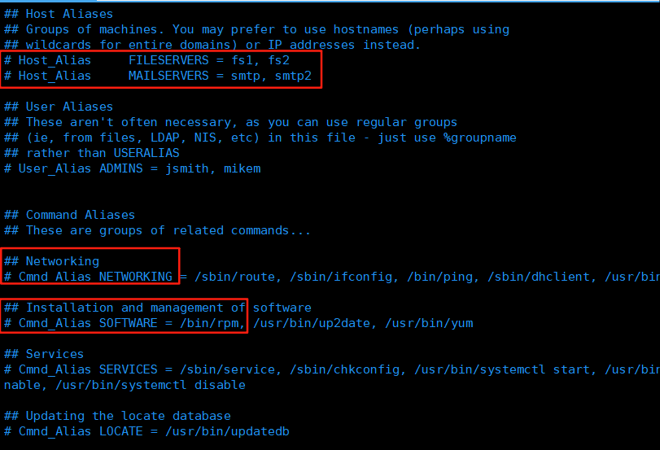
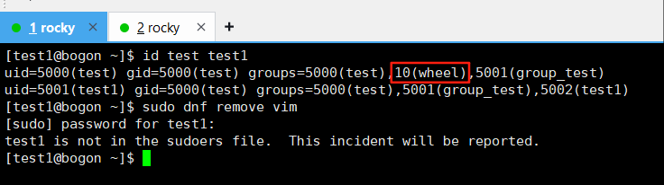
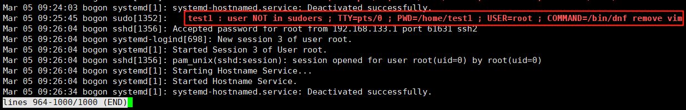
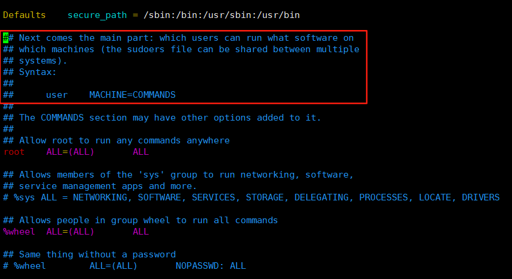
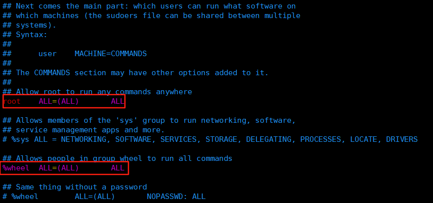
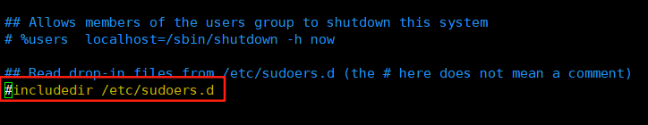
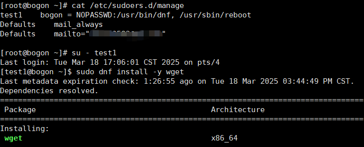

sudo访问控制
======================
在 :doc:`3_user_manage` 中，我们短暂接触过 ``sudo`` 命令，加入 ``wheel`` 用户\
组后的 ``test`` 用户，也可以通过 ``sudo`` 命令以root身份执行管理命令，管理命令\
通常只允许 ``root`` 用户执行。

这一章将更加深入的探讨 ``sudo`` 命令及相关内容。

在sudoers中授权
------------------
在 ``/etc/sudoers`` 中可以指定某一个用户可以使用 ``sudo`` 执行管理命令，\
也可以指定某一个用户组可以使用 ``sudo`` 执行管理命令。此外还可以限制这些用户\
执行哪些管理命令，限定执行管理命令的主机，还可以通过 ``aliases`` 将多个规则\
组合在一起。

可以使用 ``vim`` 命令查看 ``/etc/sudoers`` 文件中的内容，该文件已默认定义了一些\
``alias`` 组合规则：

如上图所示，``/etc/sudoers`` 文件中定义了 ``Host_Alias``，``Cmnd_Alias NETWORKING``\
等 ``alias`` 示例组合规则，这些规则可以限制用户在执行 ``sudo`` 命令时的范围。

.. hint:: 

    ``/etc/sudoers`` 必须通过 ``visudo`` 命令进行编辑，``visudo`` 命令会检查\
    ``/etc/sudoers`` 文件的语法，如果语法错误，将无法保存修改。

    不要通过 ``vim`` 直接对 ``/etc/sudoers`` 文件进行编辑，这样可能会导致文件\
    语法错误，从而导致 ``sudo`` 命令无法正常使用。

如果一个用户没有经过授权，通过 ``sudo`` 执行命令，系统会提示用户没有在 ``sudoers``\
文件中授权，无法执行命令，同时将在系统日志中记录这一事件。

如上图所示，``test1`` 用户没有在 ``wheel`` 用户组中，也没有在 ``/etc/sudoers`` 文件中\
授权，因此无法卸载 ``vim`` 软件，同时系统日志中记录了这一事件。

使用 ``journalctl -e`` 查看最新的系统日志，系统日志记录了 ``test1`` 用户没有 ``sudo`` 权限的事件，\
按 ``q`` 键退出查看。

.. hint:: 

    ``journalctl`` 命令是查询系统日志的命令，``-e`` 选项表示显示最新的日志。

    更多关于 ``journalctl`` 的信息，请通过 ``journalctl --help`` 和 ``man journalctl`` 命令了解。\
    后续有章节会介绍相关内容。

用户授权的章节在如下的位置，在普通模式下输入 ``90G`` （在90行处）即可跳转到此处：

在此之前的内容保持默认即可，多数是 ``sudo`` 的环境配置内容，无须修改保持默认即可。

图中 ``Syntax`` 处给出了用户授权的语法 ``user    MACHINE=COMMANDS``，这是简短的\
说明，完整的说明是 ``<username> <hostname.example.com>=(<run_as_user>:<run_as_group>) <path/to/command>``：

- ``<username>``：用户名，如 ``test1``。如果是以 ``%`` 开头，则是用来定义用户组，如 ``%wheel``。
- ``<hostname.example.com>``：主机名，如 ``bogon``，用来决定规则是否生效。
- ``<run_as_user>:<run_as_group>``：指定命令执行时的用户或用户组，如果此项为空，则使用 ``root`` 用户。
- ``<path/to/command>``：命令的绝对路径，同时还可以指定该命令的选项，如果没有指定选项，则默认可以执行\
  该命令的所有选项，多命令用逗号分隔。

  .. hint:: 

    绝对路径与相对路径的区别：

    .. image:: ../images/sysAdmin/5_sudo/1-6.png
       :align: center

    如上图所示, ``share_dir/test_file`` 是一个相对路径，而 ``/opt/share_dir/test_file`` 是一个绝对路径。\
    区别就在于路径是否以 ``/`` 开头，以 ``/`` 开头的路径是绝对路径，否则是相对路径。

如果想向用户授予所有的<主机>上的<用户>:<用户组>及所有<命令>的执行权限，可以使用 ``ALL`` 来代替，如 ``/etc/sudoers`` \
中的 ``root`` 和 ``%wheel`` 授权：

.. warning:: 

    使用 ``ALL`` 进行授权时，会引起极大的安全隐患。

    实际使用过程中遵循最小权限原则，如系统中运行了数据库服务，只授予数据库管理员关于数据库的\
    相关管理命令，而系统管理命令不授予。

在授权语法中，还可以使用 ``!`` 。 如 ``!root`` ，即除了 ``root`` 用户之外的所有用户，不过比起\
常规的授权语法，该语法有一定风险。常规方法对于新增的用户，用户组是无效的，需要对新增用户和用户组进行\
授权，而 ``!root`` 的方法，新用户可以直接获得授权。

因此应该尽量避免使用 ``!`` 的方法进行授权。

系统将会从头到尾读取 ``/etc/sudoers`` 文件中的授权规则，因此在 ``/etc/sudoers`` 文件中，\
如果存在多条针对某个用户的授权冲突规则，系统将会使用最后一条授权规则。比如第30行授权用户可以进行\
服务重启，又在第40行禁止该用户进行服务重启，最终生效的规则将是后者。

未了避免 ``/etc/sudoers`` 文件被意外修改，方便授权规则有问题是排查错误，在新增授权规则时，\
将新规则写入到 ``/etc/sudoers.d`` 目录下，而非直接写入到 ``/etc/sudoers`` 文件中。\
在 ``/etc/sudoers`` 文件中，有以下内容时，系统将会读取 ``/etc/sudoers.d`` 目录下的所有文件：

注意，此处的 ``#`` 不是注释符，而是语法。

sudoers文件授权实战
----------------------
在了解完 ``/etc/sudoers`` 文件的语法和内容后，我们来实战一下。

授权某个组内成员以 ``root`` 身份执行命令
^^^^^^^^^^^^^^^^^^^^^^^^^^^^^^^^^^^^^^^^^^^^^^^^^^^^^
系统管理员可以为非 ``root`` 用户授予 ``sudo`` 权限来允许他们执行管理命令。 ``sudo`` 命令\
可以做到让这些用户不需要 ``root`` 密码来执行管理命令。

当用户需要执行管理命令时，在管理命令前加上 ``sudo`` ，如之前用到的 ``test`` 用户执行 ``sudo passwd root`` 命令，\
该命令可以让 ``test`` 用户以 ``root`` 身份执行 ``passwd`` 命令。如果没有授权，则会提示用户没有权限，并将此次\
事件记录到系统日志中。

但 ``sudo`` 有以下限制：

- 只有在 ``/etc/sudoers`` 文件中授权的用户才能使用 ``sudo`` 命令。
- 使用 ``sudo`` 执行命令时，命令是运行在执行用户下的 `shell`_ 中，而非 ``root`` 用户下的\
  ``shell`` 中。这在某些情况下，命令可能会执行异常，此时需要在 ``root`` 用户下的 ``shell`` 中\
  执行命令：

  - ``sudo -i`` ：在目标用户的 ``shell`` 环境中执行命令。
  - ``sudo su -`` ： 切换到目标用户的 ``shell`` 环境。

.. _shell: https://baike.baidu.com/item/shell/99702

接下来看如何授权某个组内全部成员以 ``root`` 身份执行命令：

1. 打开 ``/etc/sudoers`` 文件，注意是root用户。

   .. code:: bash

    visudo

   ``/etc/sudoers`` 文件中，定义各种授权规则，由 ``sudo`` 命令应用定义好的授权规则。

2. 在 ``vim`` 中执行 ``90G`` （在90行处），跳转到以下位置：

   .. image:: ../images/sysAdmin/5_sudo/1-9.png
    :align: center

   该条规则在系统安装好之后就默认定义好了， ``wheel`` 用户组内的用户可以执行所有的管理命令。因为\
   ``ALL`` 表示所有的主机，所有的用户，所有的命令。
   
   还记得语法吗？<主机>=(用户:用户组) 命令

3. 这就是 ``test`` 用户可以为 ``root`` 用户更改密码的原因（见之前的章节：:ref:`non_root`），\
   执行 ``:q!`` 退出 ``visudo``，查看 ``test`` 用户的组信息。

   .. image:: ../images/sysAdmin/5_sudo/1-10.png
    :align: center

4. 验证 ``test`` 用户执行 ``sudo`` 时的身份：

   .. code:: bash

    # 切换到test用户
    su - test
    # 查看test用户的身份
    whoami
    # 查看test用户以root身份执行的身份
    sudo whoami

   .. image:: ../images/sysAdmin/5_sudo/1-11.png
     :align: center

如果需要权限其它组，可复制 ``wheel`` 组的授权规则，修改 ``%wheel`` 为需要授权的组名即可，\
如果需要将其它用户设置为管理员，可直接使用 ``usermoad --append -G wheel 用户名`` 即可。

授权用户执行特定命令
^^^^^^^^^^^^^^^^^^^^^^^^^^^
管理员可以将特定的命令授权给某个用户，比起授权 ``ALL`` 权限或将 ``root`` 密码告诉他人，这样\
做更加安全，有如下原因：

- 授权更加颗粒化：只允许用户在特定的主机上执行特定的命令，而非所有的命令。
- 更好的进行日志记录：当用户通过 ``sudo`` 执行动作时，该动作连同用户名都会被系统记录。

  .. image:: ../images/sysAdmin/5_sudo/1-12.png
    :align: center

- 透明管理：当用户通过 ``sudo`` 执行动作时，可以收到邮件通知。

接下来为特定用户授权执行特定命令，注意是用root用户进行操作：

1. 在 ``/etc/sudoers.d`` 下创建一个新的授权文件：

   .. code:: shell

    visudo -f /etc/sudoers.d/manage

   ``visudo`` 将会在这个目录下自动创建 ``manage`` 文件。 ``-f`` 指定配置文件的路径，可\
   通过 ``visudo --help`` 和 ``man visudo`` 了解更多关于 ``visudo`` 的信息。

2. 不熟悉语法的情况下，可以参考 ``/etc/sudoers`` 中的示例来写， ``vim`` 可以直接分屏打开其它\
   文件，在vim中直接执行 ``vsplit /etc/sudoers`` ：

   .. image:: ../images/sysAdmin/5_sudo/1-13.png
    :align: center

   按下 ``ctrl+w`` 后再按下 ``l`` 键可将光标切换到右边的窗口中；按下 ``ctrl+w`` 后再按下\
   ``h`` 键可将光标切换到左边的窗口中。

   在左面窗口执行 ``100G`` （在100行处）跳转到 ``root`` 用户授权规则下，然后切换到右面的窗口，\
   对照 ``root`` 用户的授权规则，为 ``test1`` 用户授予 ``dnf`` 和 ``reboot`` 命令的权限：

   .. code:: shell

       test1    bogon = /usr/bin/dnf, /usr/sbin/reboot

   .. hint:: 

       ``bogon`` 是一个主机名，这里指限制在该主机名中执行，在命令提示符中有显示，如 ``[root@bogon ~]#`` 中的 ``bogon`` ，或者\
       执行 ``hostname`` 命令查看主机名。

       ``sudo`` 授权中要使用命令的绝对路径，如何知道命令的绝对路径？可以使用 ``which`` 命令，如\
       ``which dnf`` ，将显示 ``dnf`` 命令的绝对路径。

       ``=`` 号后的语法是指定执行用户和用户组，此处省略了，表示使用以 ``root`` 用户执行。

       注意Linux中的任何配置文件中的标点符号都要是英文的，否则可能会导致语法错误。

       ``vim`` 分割窗口的内容，可在 ``vim`` 内参见 ``help usr_08.txt`` 中的内容。

3. 在test1用户授权规则的下一行，添加邮件通知配置：

   .. code:: shell

    Defaults    mail_always
    Defaults    mailto="xxxx@xxxx.com"

   .. image:: ../images/sysAdmin/5_sudo/1-14.png
    :align: center

   ``xxxx@xxxx.com`` 是邮件地址，需要替换为自己的邮件地址。

   执行 ``:wqa`` 保存内容，并关闭所有编辑窗口，此时就对 ``test1`` 用户授权完成了。还需要配置\
   一个MTA（Mail Transport Agent）来实现邮件通知功能，当 ``test1`` 用户使用 ``sudo`` 执行\
   命令时，系统将会发送邮件通知。

4. 安装MTA服务，执行以下命令安装 ``postfix`` ：

   .. code:: shell

    # 安装postfix服务
    dnf install -y postfix
    # 启动postfix服务并设置开机启动
    systemctl enable --now postfix

**验证sudo授权是否有问题**

1. 切换到 ``test1`` 用户，执行 ``sudo dnf install -y wget`` 命令，查看该命令是否能执行成功。
   
   .. image:: ../images/sysAdmin/5_sudo/1-15.png
    :align: center

2. 查看配置文件中的邮箱地址是否收到了邮件通知：

   .. image:: ../images/sysAdmin/5_sudo/1-16.png
     :align: center

   .. hint:: 

    如果你的配置没有问题，你的测试也是没有问题的，如果出现以下错误，说明你的配置有问题，请检查配置是否正确：

    用户名不匹配或配置有误：

    ``test1 is not in the sudoers file. This incident will be reported.``

    主机名不匹配或配置有误：

    ``test1 is not allowed to run sudo on bogon.``

    如果执行授权命令以外的命令，则会提示：

    ``Sorry, user test1 is not allowed to execute '/sbin/shutdown -h now' as root on bogon.``

限定执行命令的选项及参数
^^^^^^^^^^^^^^^^^^^^^^^^^^^^^^^^^
限制执行指定命令后，还可以时一步限制执行命令的选项及参数，比如 ``dnf`` 只允许执行 ``remove`` 选项：

.. code:: shell

    # 指定remove选项，*表示任意个任意参数
    test1    bogon = /usr/bin/dnf remove *, /usr/sbin/reboot

此时切换到 ``test1`` 用户再次执行 ``sudo dnf install -y wget`` 命令，系统将会提\
示 ``Sorry, user test1 is not allowed to execute '/bin/dnf install -y wget' as root on bogon.`` 的\
错误。

可以测试一下 ``dnf remove -y wget`` 是否可以执行成功。

.. hint:: 

    限制执行选项时，一定要在后面跟上以下匹配符：

    - ``*`` ：任意个任意参数（零参数或多个）
    - ``?`` ：参数是可选的，可有可无（没有参数也可）
    - ``+`` ：一个或多个参数（至少一个）

    如果不加以上匹配符，即使指定了选项，但 ``sudo`` 仍然会限制该选项的参数，导致命令执行时提示\
    ``not allowed to execute`` 的错误。

    .. image:: ../images/sysAdmin/5_sudo/1-17.png
        :align: center

免密码执行sudo
^^^^^^^^^^^^^^^^^^^^^^
如果经常使用，不希望频繁进行密码验证，也可以设置免密码执行sudo。

在配置文件中做如下修改：

.. code:: shell

    test1    bogon = NOPASSWD:/usr/bin/dnf, /usr/sbin/reboot

此时切换到 ``test1`` 用户再次执行 ``sudo dnf install -y wget`` 命令，系统将不会提示\
输入密码，可以直接执行命令。

.. hint:: 

    欲了解更多细节，请通过 ``man sudoers`` 深入探索。
