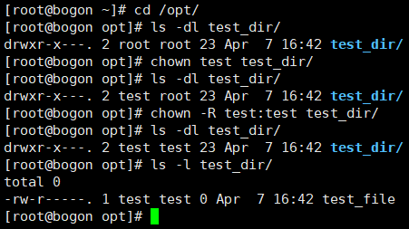

文件系统权限的管理
=======================
`文件系统`_ 控制着用户和用户组对文件的读、写、执行和文件夹的进入等权限，设置合理的权限可以保护数据安全\
以及防止未经授权的数据访问操作。

.. _文件系统: https://baike.baidu.com/item/%E6%96%87%E4%BB%B6%E7%B3%BB%E7%BB%9F/4827215

在 :doc:`/sysAdmin/3_user_manage` 中，我们使用 ``chmod`` 简单更改过文件的权限，本章节将更\
更深入的探讨文件系统权限的管理。

管理文件的权限
-------------------------
再来回顾一下文件和文件夹的权限概念，它们都有三个主要的归属者（ownership）：

- user owner(u)
- group owner(g)
- others(o)

这些属主都不三个不同的权限：

- read(r)
- write(w)
- execute(x)

执行权限对于文件来说允许你去执行它，一般用于脚本文件；对于文件夹来说允许你 ``cd`` 进入它以及 ``ls`` \
查看文件夹内的文件，而不是执行文件夹。

当一个新的文件或文件夹被创建时，会被设置一组默认的权限，这组默认权限由以下两个因素决定：

- 基础权限
- 用户文件创建掩码（umask:user file-creation mode mask）

.. _base_permission:

基础权限
^^^^^^^^^^^^^^^^
当一个新的文件或文件夹被创建时，会被分配一个基础权限，基础权限可以由符号或 `八进制`_ 数值进行表示：

.. _八进制: https://baike.baidu.com/item/%E5%85%AB%E8%BF%9B%E5%88%B6/4230825

============   ========  ===========
权限             符号值      八进制值
============   ========  ===========
无权限           ---          0
执行             --x          1
写              -w-          2
写和执行         -wx          3
读              r--          4
读和执行         r-x          5
读和写           rw-          6
读、写和执行      rwx          7
============   ========  ===========

.. hint:: 

    八进制数值转换为 `二进制`_ 正好标记了文件的权限，如：

    .. _二进制: https://baike.baidu.com/item/%E4%BA%8C%E8%BF%9B%E5%88%B6/361457

    ========  ======== ========
     八进制     二进制    符号值
    ========  ======== ========
     6         0110      rw-
     5         0101      r-x
     3         0011      -wx
    ========  ======== ========

    二进制的后三位，分别对应文件的三位权限，有权限为1，无权限为0。

    二进制转换为八进制后，就是上面表格的内容了。

文件夹的基础权限是777（drwxrwxrwx），任何人都可以读、写和执行（进入文件夹），也就是说，\
user owner、group owner和others都可以在该文件夹内增加删除文件（w），查看列出文件夹内的所有\
内容（r），以及进入该文件夹（x）。

.. note:: 

    尽管文件夹没有限制，可以执行任何动作，但文件夹中的文件是有单独的权限的，不一定可以对它\
    随意编辑，删除。

    如test_dir文件夹的权限是777，而test_dir下的test_file的权限是700，那么test_file就只能\
    被test_dir的user owner编辑和删除，其它人都不能对它进行任何操作。

    也就是说777的文件夹中可以看到700的文件，但是不能对它进行编辑。文件和文件夹的权限都是各自独立的，\
    只对自己生效。

文件的基础权限是666（-rw-rw-rw-），任何人都可以读和写，但没有执行权限。

====

当一个新文件或新文件夹被创建时，虽然分配了基础权限，但它不是默认权限，基础权限与用户文件创建掩码（umask）组合后\
才是最终的默认权限。

用户文件创建掩码
^^^^^^^^^^^^^^^^^^^^^
用户文件创建掩码（umask:user file-creation mode mask）是一个变量，用来控制如何为新创建的文件和\
文件夹设置默认权限。 ``umask`` 将自动删除基础权限中的某些权限来提高整个系统的安全性， ``umask`` \
也是由符号或八进制数值进行表示，不过和基础权限是相反的：

============   ========  ===========
权限             符号值      八进制值
============   ========  ===========
读、写和执行      rwx          0
读和写           rw-          1
读和执行         r-x          2
读              r--          3
写和执行         -wx          4
写              -w-          5
执行             --x          6
无权限           ---          7
============   ========  ===========

普通用户和root用户的默认umask都是0022，第一位是特殊权限位（sticky bit），剩下的三位分别表示\
user owner(u)、group owner(g)和others(o)的权限。

.. _default_permission:

默认权限
^^^^^^^^^^^^^^^^
默认权限是在新的文件或文件夹创建时自动设置的，由 ``umask`` 在基础权限的基础上进行计算得到。

文件夹的默认权限
""""""""""""""""""""
文件夹的基础权限是777，umask是0022，那么文件夹的默认权限如何得来？

============= ============= ================
    \-         符号值           八进制值
============= ============= ================
**基础权限**      rwxrwxrwx          777
**umask**        rwxr-xr-x          0022
**默认权限**      rwxr-xr-x          755
============= ============= ================

由上表可知，默认权限是由基础权限减去umask得到的，那事实是不是如此，我们来实验一下：

.. code:: shell

    # 跳转到/opt目录下
    cd /opt
    # 创建一个文件夹来测试
    mkdir test_dir
    # 查看文件夹的权限
    ls -l

``test_dir`` 的权限是 ``drwxr-xr-x.`` （d表示directory文件夹，.表示SELinux security context），是否和上面的\
表格计算结果一致呢？

``rwxr-xr-x`` 三位为一组，分别表示属主（owner）、属组（group）和其它（others）的权限。

``rwxr-xr-x`` 表示属主（owner)可以创建、删除和编辑这个文件夹内的内容（rw），可以进入该文件夹（x），而属组\
（owner group）和其它（others）都只能列出该文件夹内的内容和进入该文件夹（rx）。

文件的默认权限
""""""""""""""""""""
文件的基础权限是666，umask是0022，那么文件的默认权限又如何得来？

============= ============= ================
    \-           符号值           八进制值
============= ============= ================
**基础权限**      rw-rw-rw-          666
**umask**        rw-r--r--          0022
**默认权限**      rw-rw-r--          644
============= ============= ================

由上表可知，默认权限是由基础权限减去umask得到的，那事实是不是如此，我们再来实验一下：

.. code:: shell

    # 跳转到刚刚创建好的目录下
    cd /opt/test_dir
    # 创建一个文件来测试
    touch test_file
    # 查看文件的权限
    ls -l

``-rw-r--r--.`` 表示属主（owner）可以查看、编辑和删除（rw）该文件，而属组（owner group）和其它（others）只能\
查看该文件（r）。 ``-`` 表示该文件是普通文件， ``.`` 表示SELinux security context。

.. note:: 

    出于安全原因，普通文件创建时默认没有执行权限，即便把 ``umask`` 设置为 ``0000`` 也行不通，\
    只有文件夹可以在创建时默认授权执行权限。

通过chmod更改文件的权限
^^^^^^^^^^^^^^^^^^^^^^^^^^^^^^^^^^^^
文件或文件夹可以通过 ``chmod`` 命令来更改权限， 在 :doc:`/sysAdmin/3_user_manage` 中我们简单使用过，\
此处来深入探讨一下文件权限的管理。

``chmod`` 可以分配以下权限：

- read(r)
- write(w)
- execute(x)

``chmod`` 可以将文件或文件夹分配给以下不同层级的用户：

- user owner(u)
- group owner(g)
- others(o)
- all(a)

``chmod`` 可按以下的方式增加或删除权限：

- ``+`` 在已有的权限基础上增加权限。
- ``-`` 在已有的权限基础上删除权限。
- ``=`` 删除已有的权限，然后重新设置权限。

使用符号值更改文件权限
""""""""""""""""""""""""""""""""
使用符号值更改文件权限的语法如下：

.. code:: shell

    chmod mode[,mode] file_name

``mode`` 由 ``[ugoa][+-=][rwx]`` 组成，多个 ``mode`` 之间用逗号分隔，权限说明可见 :ref:`base_permission` 。

====

来实战一下为刚刚创建的 ``test_dir`` 和 ``test_file`` 更改权限：

- 更改 ``test_dir`` 的权限，不允许其他人（others）查看（r）和进入该文件夹（x），同组成员（g）可以在这里创建修改删除文件（w）：

  .. code:: shell

    # 跳转到/opt目录下
    cd /opt
    # 查看当前的test_dir权限
    ls -dl test_dir
    # 更改test_dir的权限，不允许其他人查看和进入该文件夹
    chmod o-rx,g+w test_dir
    # 再次查看test_dir的权限
    ls -dl test_dir

  .. image:: ../images/sysAdmin/6_file/1-3.png
      :align: center

  ``ls`` 的 ``-d`` 参数表示只显示目录的信息，不显示目录内的文件，可通过 ``ls --help`` 和 ``man ls`` 查看更多信息。

- 更改 ``test_file`` 的权限，设置用户（u）可以执行（x）和查看（r）该文件，同组用户（g）只可以执行该文件，其它\
  用户（o）无任何权限：

  .. code:: shell

    # 跳转到test_dir目录下
    cd /opt/test_dir
    # 查看当前的test_file权限
    ls -l
    # 更改test_file的权限，只允许用户自己查看和编辑该文件
    chmod u=rx,g=x,o= test_file
    # 再次查看test_file的权限
    ls -l

  .. image:: ../images/sysAdmin/6_file/1-4.png
       :align: center

  注意此处使用 ``=`` 的变化，它直接删除了原有的权限，然后重新设置了权限,留空表示删除全部权限。

- 同时更改 ``test_dir`` 和 ``test_file`` 的权限，设置所有人（a）只有读和执行（rx）的权限：
 
  .. code:: shell

    # 跳转到/opt目录下
    cd /opt
    # 同时更改test_dir和test_file的权限，所有人只有读和执行的权限
    chmod -R a=rx test_dir
    # 再次查看test_dir和test_file的权限
    ls -dl test_dir
    ls -l test_file

  .. image:: ../images/sysAdmin/6_file/1-5.png
       :align: center

  ``chmod`` 的 ``-R`` 参数表示递归更改，即更改目录和其目录内的权限，如果不加 ``-R`` 参数，\
  则只会更改当前目录的权限，不会更改目录内的权限。通过 ``chmod --help`` 和 ``man chmod`` 查看更多信息。

使用八进制值更改文件权限
""""""""""""""""""""""""""""""""
使用八进制值更改文件权限的语法如下，比起用符号值的语法来说，非常简单：

.. code:: shell

    chmod octal_value file_name

``octal_value`` （八进制值）共3位，每一位代表一类用户，从左至右分别是用户（u）、用户组（g）和\
其它用户（o），数值说明见 :ref:`base_permission` 。

====

来使用八进制值来更改 ``test_dir`` 和 ``test_file`` 的权限：

- 更改 ``test_dir`` 的权限，不允许其他人（others）查看（r）和进入该文件夹（x），同组成员（g）可以在这里查看和进入，用户（u）\
  拥有全部权限：

  .. code:: shell

    # 跳转到/opt目录下
    cd /opt
    # 查看当前的test_dir权限
    ls -dl test_dir
    # 更改test_dir的权限，不允许其他人查看和进入该文件夹
    chmod 750 test_dir
    # 再次查看test_dir的权限
    ls -dl test_dir

  .. image:: ../images/sysAdmin/6_file/1-6.png
    :align: center
  
- 更改 ``test_file`` 的权限，设置用户（u）可以执行（x）和查看（r）该文件，同组用户（g）只可以执行该文件，其它\
  用户（o）无任何权限：

  .. code:: shell

    # 跳转到test_dir目录下
    cd /opt/test_dir
    # 查看当前的test_file权限
    ls -l
    # 更改test_file的权限，只允许用户自己查看和编辑该文件
    chmod 510 test_file
    # 再次查看test_file的权限
    ls -l

  .. image:: ../images/sysAdmin/6_file/1-7.png
    :align: center

通过chown更改文件的属主
^^^^^^^^^^^^^^^^^^^^^^^^^^^^^^^^^^^^
在 :ref:`create_dir` 中我们使用 ``chgrp`` 命令更改了文件夹的属组，而文件和文件夹的属主可以通过 ``chown`` 命令来更改。

主要用法为： ``chown -R [属主][:属组] file_name`` , 其中 ``-R`` 表示递归更改，即更改目录和其目录内的权限。

.. code:: shell

    # 跳转到test_dir目录下
    cd /opt/
    # 查看当前的test_dir权限
    ls -dl test_dir
    # 更改test_dir的属主
    chown test test_dir
    # 查看当前的test_dir权限
    ls -dl test_dir
    # 甚至可以连同属组和文件夹内的内容一同修改
    chown -R test:test test_dir
    # 再次查看test_dir的权限
    ls -dl test_dir
    # 查看test_dir目录下的文件
    ls -l test_dir
    

.. hint:: 

  通过 ``man chown`` 了解更多信息。

管理umask
-------------------------
基础权限与 ``umask`` 的组合就是默认权限，而 ``umask`` 是可以被更改的，我们可以通过 ``umask`` 命令来\
显示、设置或更改默认的 ``mask`` 值。

显示当前的 ``umask`` 值
^^^^^^^^^^^^^^^^^^^^^^^^^^^^^^^^^^^^
使用 ``umask`` 命令以符号值或八进制值显示当前的umask值：

.. code:: shell

  # 以符号值显示当前的umask值，而且这个符号值是创建时使用的默认值
  umask -S
  # 以八进制值显示当前的umask值
  umask

如果忘记了 ``umask`` 、基础权限与默认权限之间的影响关系，可参考上面的章节：:ref:`default_permission` 。

.. note:: 

  以八进制显示umask时， ``umask`` 命令显示了四位数字，umask参与默认权限计算时，只有后三位有实际影响。

  第一位数字是特殊位，它可以表示 ``sticky bit`` （粘滞位）、 ``SGID bit`` （设置用户组ID，set group id）\
  和 ``SUID bit`` （设置用户ID，set user id），如果没有设置，则显示为 ``0`` 。

  后续会有相关内容做详细介绍。

设置umask值
^^^^^^^^^^^^^^^^^^^^^^^^^^^^^^^^^^^^
``umask`` 也可以用来设置umask值，其用法与 ``chmod`` 用法极其相似：

.. code:: shell
  
  # 以符号值设置umask值，mode由[ugoa][+-=][rwx]组成，用逗号分隔
  chmod mode[,mode] file_name
  # 也可以用八进制值设置umask值
  umask octal_value

来测试一下，设置umask会对新创建的文件和文件夹产生什么影响：

.. code:: shell

  # 用符号值设置umask值，所有用户都有rwx的权限
  umask -S a=rwx
  # cd到/opt目录下
  cd /opt
  # 创建一个文件夹
  mkdir test_umask
  # 查看文件夹的权限
  ls -dl test_umask
  # 创建一个文件
  touch test_umask_file
  # 查看文件的权限
  ls -l test_umask_file

.. hint:: 

  发现了吗？之前提到过，哪怕强行设置所有用户都有 ``rwx`` 的权限，但是文件的默认权限在创建时，\
  仍然会被减去执行权限，也就是 ``rwx`` 变为 ``rw-`` ，这是出于安全考虑的。

  不过文件夹不影响，它在创建时仍然保留执行权限，如期创建了所有用户都有 ``rwx`` 权限的文件夹。

  把创建的文件夹和文件删除，方便接下来的测试：

  .. code:: shell

    # 删除所有以test_umask开头的文件夹和文件，*号用来匹配后面的任意字符
    rm -rf test_umask*
    # r表示recursive递归删除，用来删除文件夹的
    # f表示force强制删除，不再询问是否删除，不加f参数会询问是否删除

再测试一下使用八进制值设置umask值：

.. code:: shell

  # 用八进制值设置umask值，用户有读和执行权限，组用户只有执行权限，其它用户没有任何权限
  umask 0267
  # cd到/opt目录下
  cd /opt
  # 创建一个文件夹
  mkdir test_umask
  # 查看文件夹的权限
  ls -dl test_umask
  # 创建一个文件
  touch test_umask_file
  # 查看文件的权限，umask里即使设置了执行权限，创建文件时也会移除执行权限
  ls -l test_umask_file

.. note:: 

  无论通过哪种方式使用 ``umask`` 命令设置umask值，都只对当前登录的窗口有效。
  
  它是临时生效的，断开后再次连接，umask值会恢复为默认值。

  哪怕重新建立一个窗口连接，新窗口的umask值也是默认的，不会继承之前设置的umask值。

永久设置umask值
^^^^^^^^^^^^^^^^^^^^^^^^^^^^^^^^^^^^
``umask`` 命令设置的umask值只对当前登录的窗口有效，可以通过修改 ``/etc/login.defs`` 来使\
umask值永久生效：

.. code:: shell

  # 使用root用户打开/etc/login.defs文件，并使光标位于117行处
  vim +117 /etc/login.defs
  # 按R进入替换模式，将022替换为027，保存退出

  
修改完配置文件后，当前的会话窗口并不会立即生效，需要退出后重新登录才能生效：

如上图所示，重新登录后，新的umask值已经生效，且新创建的文件夹的默认权限已经改变，其它用户\
（o）已经不在拥有读和执行的权限了。

umask值甚至可以只针对某一用户设置特殊的umask值：

.. code:: shell

  # 为test用户设置特殊的umask值，打开test用户家目录下的.bashrc文件,并使光标位于最后一行
  vim +$ vim +$ /home/test/.bashrc
  # 按下o在一行进入插入模式，输入umask 022
  umask 022
  # 保存退出

====

使用 ``su - test`` 切换到test用户，再次查看umask值：

.. hint:: 

  `bash`_ 是绝大多数Linux发行版的默认shell，它是一个命令解释器，它读取用户输入的命令，并执行相应的操作。

  .. _bash: https://baike.baidu.com/item/Bash/6367661

  在登录系统后，会调起一个bash供用户使用，在这个过程中，bash首先会读取 ``/etc/profile`` 文件，\
  然后读取 ``~/.bash_profile`` 文件，``~/.bash_profile`` 文件会读取 ``~/.bashrc`` 文件，\
  然后等待用户输入命令。

  所有用户都有这些配置文件，它们位于用户的家（home）目录下，root用户一般为 ``/root`` ，\
  普通用户一般为 ``/home/用户名`` 。

  因此在 ``~/.bashrc`` 文件中设置了umask值，会覆盖 ``/etc/login.defs`` 文件中的umask值，\
  所以test用户的umask值会被覆盖为022。

  ``profie`` 文件是关于系统环境的配置文件，``bashrc`` 文件是关于系统功能（functions）的配置文件。

特殊权限位
-------------------------
前面提到过，umask的第一位是特殊权限位，它可以表示 ``sticky bit`` （粘滞位）、 ``SGID bit`` （设置用户组ID，set group id）\
和 ``SUID bit`` （设置用户ID，set user id），如果没有设置，则显示为 ``0`` 。

那这些权限具体有什么用？

SUID bit(set user id)
^^^^^^^^^^^^^^^^^^^^^^^^^^^^^^^^^^^^
SUID bit可以使一个文件在执行时，以文件的拥有者（owner）的身份运行，而不是以当前用户的身份运行：

1. 查看 ``passwd`` 命令的文件的属性：

   .. code:: shell

    # 找到passwd命令的路径
    which passwd
    # 查看查到的文件路径属性
    ls -l /usr/bin/passwd

   .. image:: ../images/sysAdmin/6_file/1-15.png
     :align: center
  
   可以看到 ``passwd`` 命令的属性是 ``-rwsr-xr-x.`` ，原本位于owner位的 ``x`` 变成了 ``s`` ，\
   这就是SUID bit。

2. 在xshell中再打开一个窗口，切换到test用户，执行 ``passwd`` 命令：

   .. code:: shell

    # 切换到test用户
    su - test
    # 执行passwd命令，但不输入任何内容
    passwd
  
   返回另一个窗口，执行以下命令查看 ``passwd`` 的进程：

   .. code:: shell

    # 查看passwd命令的进程
    ps -ef | grep passwd

   .. image:: ../images/sysAdmin/6_file/1-16.png
     :align: center

   .. hint:: 

      ``ps`` 命令用于显示当前正在运行的进程信息，``-ef`` 参数用于显示所有用户的进程信息，\
      ``grep`` 命令用于过滤进程信息，``|`` 表示管道，将 ``ps`` 命令的输出作为 ``grep`` 命令的输入。

      可以看到 ``passwd`` 命令的进程是 ``root`` 用户的，而不是 ``test`` 用户的。

      这是因为 ``passwd`` 命令的属性是 ``-rwsr-xr-x.`` ，原本位于owner位的 ``x`` 变成了 ``s`` ，\
      这就是SUID bit。

      当一个文件的SUID bit被设置时，它会在执行时，以文件的拥有者（owner）的身份运行，而不是以当前用户的身份运行。

      通过 ``man ps`` 和 ``man grep`` 了解更多信息。

不过出于安全考虑，SUID bit被绝大多数Linux发行版禁用了，因为它可以使一个文件在执行时，以文件的\
拥有者（owner）的身份运行，而不是以当前用户的身份运行，这会导致文件内容可能被随便更改，从而产生极大的\
安全隐患。因此，即使对普通文件设置了SUID bit，系统仍然会忽略它，不会生效。

SUID bit对于文件夹也有特殊作用，当一个文件夹的SUID bit被设置时，在该文件夹内创建文件，该文件的owner\
会直接设置为该文件夹的owner，而不是当前用户的身份；在该文件夹内创建的文件夹，也会为这个子文件夹设置\
SUID bit。不过同样的出于安全考虑，大部分的Linux发行版同样禁用了该项特性。

SGID bit(set group id)
^^^^^^^^^^^^^^^^^^^^^^^^^^^^^^^^^^^^
SGID bit与SUID bit类似，但是它是设置用户组ID，而不是设置用户ID，它可以使一个文件在执行时，以文件的\
用户组（group）的身份运行，而不是以当前用户组的身份运行；对于文件夹来说，在该文件夹内创建的文件，\
该文件的group会直接设置为该文件夹的group，而不是当前用户组的身份；在该文件夹内创建的文件夹，也会为这个\
子文件夹设置SGID bit。

如在 :ref:`vali_dir` 中创建的 ``share_dir`` 文件夹，在其内部创建的 ``test_file`` 文件，其group\
会直接设置为 ``share_dir`` 的group，而不是当前用户组的身份。

注意位于group权限位中的 ``x`` 变成了 ``s`` ，SGID的特性被绝大多数的Linux发行版保留，该项特性可以正常使用。

sticky bit
^^^^^^^^^^^^^^^^^^^^^^^^^^^^^^^^^^^^
sticky bit是用来防止他人删除或重命名自己的文件：

1. 查看系统临时目录的属性：

   .. code:: shell

    # 查看系统临时目录的属性
    ls -dl /tmp

2. 切换到test用户，在 ``/tmp`` 目录下创建一个文件：

   .. code:: shell

    # 切换到test用户
    su - test
    # 在/tmp目录下创建一个文件
    touch /tmp/test_file
    # 退出test用户
    exit

3. 切换到test1用户，在 ``/tmp`` 目录下删除 ``test_file`` 文件：

   .. code:: shell

       # 切换到test1用户
       su - test1
       # 在/tmp目录下删除test_file文件，按y确认删除
       rm /tmp/test_file

``test1`` 用户想删除 ``test`` 用户在 ``/tmp`` 目录下创建的 ``test_file`` 文件，但系统\
提示该操作不允许，因为 ``/tmp`` 目录的属性是 ``drwxrwxrwt.`` ，原本位于other位的 ``x`` 变成了 ``t`` ，\
这就是sticky bit。

.. hint:: 

  sticky bit只能阻止普通用户删除或重命名他人的文件，但无法阻止root用户。

  .. image:: ../images/sysAdmin/6_file/1-19.png
    :align: center

特殊权限位的设置
^^^^^^^^^^^^^^^^^^^^^^^^^^^^^^^^^^^^
特殊权限位的设置与文件的权限设置类似，也可以通过符号值或八进制值设置：

- 符号值设置：

  s只可用于u（owner）和g（group），可用于文件和文件夹，符号值设置语法如下：

  .. code:: shell

    # 接着使用test_dir做测试
    cd /opt
    # 设置文件夹的SUID bit及SGID bit
    chmod u+s,g+s test_dir

  t只可用于o（others），只用于文件夹且other位权限为 ``rwx`` ，符号值设置语法如下：

  .. code:: shell

    # 设置文件夹的other位权限为rwx以及sticky bit
    chmod o+rwxt test_dir

  .. image:: ../images/sysAdmin/6_file/1-20.png
    :align: center

- 八进制值设置：

  setuid bit（s）为4，setgid bit（s）为2，sticky bit（t）为1，八进制值设置语法如下：

  .. code:: shell

    # 去除特殊权限位
    chmod u-s,g-s,o-t test_dir
    # 设置文件夹的SGID bit及sticky bit，并授权全部权限
    chmod 3777 test_dir

  .. image:: ../images/sysAdmin/6_file/1-21.png
    :align: center

管理访问控制列表
-------------------------
无论文件还是文件夹，都只有一个用户和用户组，如果既想保持other位的私密性，又想在给其它的用户和用户组\
一些权限，这时候就可以使用访问控制列表（Linux Access Control Lists, ACLs）来达成该目的。

- 为文件或文件夹设置ACL可使用以下命令：

  .. code:: shell

    # 设置文件或文件夹的ACL，-R可以递归为文件夹和文件夹内的文件设置ACL
    setfacl -m u:用户名:符号值 file_name
    setfacl -m g:用户组名:符号值 file_name
    setfacl -R -m u:用户名:符号值 dir_name
    # 取消文件或文件夹的ACL
    setfacl -x u:用户名 file_name
    setfacl -x g:用户组名 file_name
    setfacl -R -x u:用户名 dir_name
    # 取消全部ACL
    setfacl -b file_name
    setfacl -b dir_name

- 查看文件或文件夹的ACL可使用以下命令：

  .. code:: shell

    # 查看文件或文件夹的ACL
    getfacl file_name
    getfacl dir_name

====

下面我们来创建一个文件夹用来测试ACL：

1. 创建一个文件夹，并授权 ``test`` 用户可以查看、创建和进入该文件夹：

   .. code:: shell

    # 跳转到/opt目录下
    cd /opt
    # 创建一个文件夹
    mkdir test_acl
    # 授权test用户可以查看、创建和进入该文件夹
    setfacl -m u:test:rwx test_acl

2. 查看 ``test_acl`` 文件夹的ACL：

   .. code:: shell

       # 查看test_acl文件夹的ACL
       getfacl test_acl
       ls -dl test_acl

   .. image:: ../images/sysAdmin/6_file/1-22.png
      :align: center

   .. hint:: 

     注意到 ``ls -dl test_acl`` 命令的输出结果中有一个 ``+`` 了吗？这是因为 ``test_acl`` 文件夹的ACL\
     被设置了，所以 ``ls -dl test_acl`` 命令的输出结果中会有一个 ``+`` ，表示有额外的访问权限控制。

3. 切换到test用户，在 ``test_acl`` 文件夹下创建一个文件：

   .. code:: shell

       # 切换到test用户
       su - test
       # 在test_acl文件夹下创建一个文件
       cd /opt/test_acl
       touch test_file
       ls -l
       # 退出test用户
       exit

   .. image:: ../images/sysAdmin/6_file/1-23.png
       :align: center

   .. hint:: 

    尽管 ``test_acl`` 不属于 ``test`` 用户，但是 ``test`` 用户可以在 ``test_acl`` 文件夹下创建文件，\
    这就是ACL的独特作用。

4. 删除 ``test`` 用户对于 ``test_acl`` 文件夹的访问权限：

   .. code:: shell

       # 删除test用户对于test_acl文件夹的访问权限
       setfacl -x u:test test_acl
       # 再次查看test_acl文件夹的ACL
       getfacl test_acl

5. 删除全部的ACL信息：

   .. code:: shell

       # 删除test_acl文件夹的ACL
       setfacl -b test_acl
       # 再次查看test_acl文件夹
       ls -dl test_acl

   .. image:: ../images/sysAdmin/6_file/1-24.png
       :align: center

   .. hint::

    当ACLs被删除后， ``ls -dl test_acl`` 命令的输出结果中就没有 ``+`` 了，它不再有额外的访问权限控制了。

    通过 ``man setfacl`` 和 ``man getfacl`` 了解更多信息。

