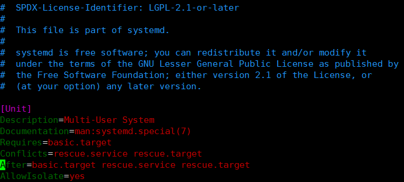
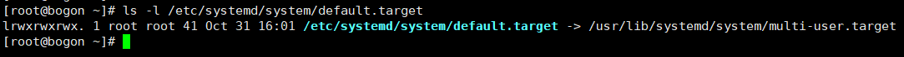
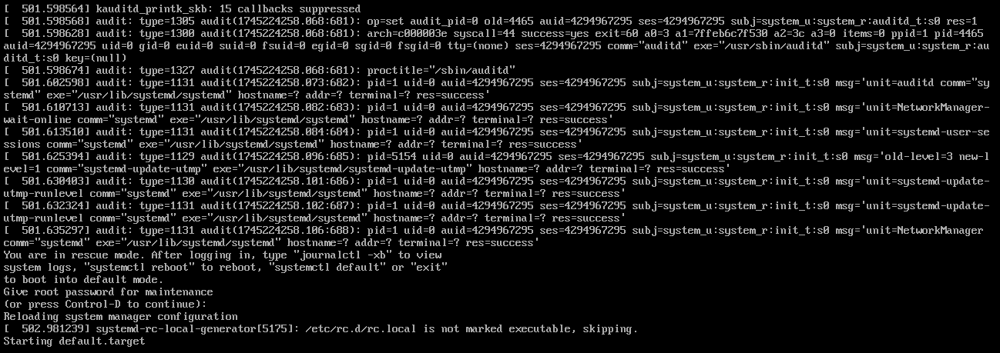
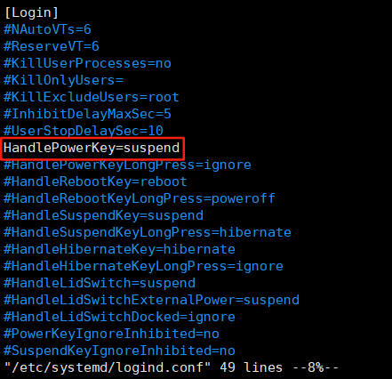
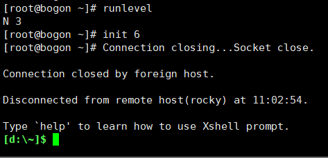

系统服务管理
===========================
系统服务管理是Linux系统中非常重要的事情，该项工作是由 ``systemd`` 来完成的。 ``systemd`` 是\
一套软件包（software suite），它提供了很多工具和服务，用于对系统的控制、报告和系统初始化。

``systemd`` 具有以下关键特性：

- 在系统启动时并行启动多个服务
- 按需要启动后台服务
- 按服务间的依赖关系进行控制管理

``systemd`` 的基础单位称之为 ``systemd unit`` ，它代表着系统资源（resources）和服务（services）。 ``systemd unit`` 包括\
名称、类型和配置文件，它们定义和管理了某个特定的任务，通过 ``systemd unit`` 可以配置系统的某些行为。\
``systemd unit`` 有以下几种类型：

- service
  
  控制和管理单独的系统服务

- target

  一组 ``systemd unit`` ，用于定义系统状态

- device

  管理硬件设备以及它们的可用性

- mount

  管理文件系统的挂载

- timer

  编排系统任务以特殊的间隔运行

systemd unit的配置文件位置
----------------------------
systemd unit的配置文件在以下目录中：

==========================    ========================================================================   
目录                                说明
==========================    ========================================================================   
/usr/lib/systemd/system/      由软件包在安装时放置的配置文件
/run/systemd/system/          程序运行时生成的配置文件，优先级高于软件包安装时放置的配置文件
/etc/systemd/system/          由 ``systemctl enable`` 命令生成的配置文件，优先级高于程序运行时生成的配置文件
==========================    ========================================================================     

``systemd`` 的配置文件在 ``/etc/systemd/system.conf`` 中，该文件中的参数可影响 ``systemd units`` \
的行为。

通过systemctl管理系统服务
----------------------------
``systemctl`` 是一个管理系统的工具，通过它可以执行多种任务：服务的启动、停止和重启，启用或禁用开机\
自启动，列出可用的服务，查看系统服务的状态等。

查看系统服务
^^^^^^^^^^^^^^^^^^^^
使用 ``systemctl`` 列出系统中所有已载入的service units，并查看它们的状态：

- 列出已载入的service units

  .. code-block:: shell

    systemctl list-units --type service

  .. image:: ../images/sysAdmin/7_systemd/1-1.png
    :align: center
  
  .. hint:: 

    这里也可以使用 ``vim`` 中的命令，如 ``hjkl`` 来移动光标， ``ctrl + d/u`` 来翻半页，\
    ``g/G`` 来移动到文件开头和结尾， ``/`` 来搜索关键字， ``q`` 退出等。

  ``systemctl list-units`` 默认只输出已经激活的units，且输出如下信息：

  - ``UNIT`` ：service unit的名称
  - ``LOAD`` ：service unit的配置文件加载状态
  - ``ACTIVE`` 和 ``SUB`` ：高等级和低等级的service unit激活状态
  - ``DESCRIPTION`` ：service unit的作用和功能性的简短描述

- 列出所有的service units

  .. code-block:: shell

    systemctl list-units --type service --all

  未激活的服务也将罗列出来

- 列出service units的状态（enabled或disabled）

  .. code-block:: shell

    systemctl list-unit-files --type service

  .. image:: ../images/sysAdmin/7_systemd/1-2.png
    :align: center

  每个service unit都会显示如下状态：

  - ``UNIT FILE`` ：service unit的名称
  - ``STATE`` ：service unit的状态，启用enabled或禁用disabled
  - ``PRESET`` ：service unit的预设状态

查看服务状态
^^^^^^^^^^^^^^^^^^^^
``systemctl`` 可以查看service unit的详细信息并确认其状态，无论它是否是开机自启动的或是否\
正在运行，甚至可以基于某一个service unit来查看哪些service unit是先于/后于它启动的。

- 查看service unit的状态，如查看 ``postfix.service`` 的状态：

  .. code-block:: shell

    systemctl status postfix.service

  此处可使用 ``Tab`` 键进行补全，输入 ``pos`` 后按 ``Tab`` 键，会自动补全为 ``postfix.service`` 。

  .. image:: ../images/sysAdmin/7_systemd/1-3.png
    :align: center

  ``status`` 命令会显示如下信息：

  - 该services unit的名称及简介，如上图中的第一行文字
  - 该services unit的信息，如 ``Loaded`` 和 ``Active`` 两行文字
  - 该services unit的执行信息，如 ``Process`` 行及 ``Main PID`` 等行处的文字
  - 该services unit的近期的日志信息，如 ``Apr`` 处的三行文字
  
  services unit信息

  ===========  ================================================================
   字段              说明
  ===========  ================================================================
   Loaded       service unit是否已加载，其绝对路径以及是否是开机自启动以及预设状态
   Active       service unit是否是运行状态且显示其启动时间及运行时长
   Main PID     service unit的主进程的PID（Process ID）以及其代表的系统服务名
   Process      service unit相关的进程信息
   CGroup       service unit相关的control groups信息（cgroups [#f1]_）
  ===========  ================================================================

- 查看某一个服务是否正在运行中，如查看 ``postfix.service`` 的状态：
  
  .. code:: shell

    systemctl is-active postfix.service

  若返回 ``active`` 则表示正在运行，若返回 ``inactive`` 则表示未运行。

- 查看某一个服务是否开机自启动，如查看 ``postfix.service`` 的状态：

  .. code:: shell

    systemctl is-enabled postfix.service
  
  若返回 ``enabled`` 则表示开机自启动，若返回 ``disabled`` 则表示未开机自启动。

- 按启动顺序查看某一个服务之前启动了哪些服务，如查看 ``postfix.service`` 的状态：

  .. code:: shell

    systemctl list-dependencies --after postfix.service

  .. image:: ../images/sysAdmin/7_systemd/1-4.png
    :align: center
  
- 按启动顺序查看某一个服务之后启动了哪些服务，如查看 ``postfix.service`` 的状态：

  .. code:: shell

    systemctl list-dependencies --before postfix.service

  .. image:: ../images/sysAdmin/7_systemd/1-5.png
    :align: center

  .. hint:: 

    查看在某个服务之前启动的服务，可使用 ``--after`` 选项，查看在某个服务之后启动的服务，可使用\
    ``--before`` 选项，这两个选项与字面意思相反。

    服务之间是有依赖性的，如 ``postfix.service`` 需要网络通过发送邮件，所以在 ``postfix.service`` \
    启动之前需要启动好 ``NetworkManager.service`` ，所以在 ``postfix.service`` 启动之前，\
    ``NetworkManager.service`` 会先启动；而在系统在关闭时，会先关闭 ``postfix.service`` ，然后才\
    关闭 ``NetworkManager.service`` 。

启动和关闭系统服务
^^^^^^^^^^^^^^^^^^^^
``systemctl`` 可以启动和关闭service unit。

- 关闭service unit，如关闭 ``postfix.service`` ：

  .. code:: shell

    systemctl stop postfix.service
    # 可通过status确认postfix.service是否已经关闭
    systemctl status postfix.service

  .. image:: ../images/sysAdmin/7_systemd/1-6.png
     :align: center

- 启动service unit，如启动 ``postfix.service`` ：

  .. code:: shell

    systemctl start postfix.service
    # 可通过status确认postfix.service是否已经启动
    systemctl status postfix.service

.. note:: 

  在systemd中，分为积极依赖（positive dependency）和消极依赖（negative dependency）两种依赖关系。\
  当启动一个服务时，这个服务可能需要启动另外一个或多个服务，这就是积极依赖；而启动一个服务时，\
  这个服务可能需要关闭另外一个或多个服务，这就是消极依赖。

  当你使用 ``systemctl start`` 命令启动一个服务A时，systemd会自动解析这个服务的依赖关系，如果\
  正在运行的某个服务B与将要启动的服务A属于消极依赖关系，那么systemd会自动关闭这个服务B，然后再\
  启动服务A。

重启和重新加载系统服务
^^^^^^^^^^^^^^^^^^^^^^^^^^^^^^^^
通过 ``systemctl`` 的 ``restart`` 命令可以执行以下操作：

- 关闭某个服务后再立即启动它
- 在某个服务已经运行的情况下才去重启它，否则不做任何操作
- 重新加载某个服务的配置文件但不打断其运行

====

- 重启系统服务，如重启 ``postfix.service`` ：

  .. code:: shell

    systemctl restart postfix.service

  如果 ``postfix.service`` 没有运行， ``restart`` 命令会启动它，否则会关闭它再启动它。

- 只有在某个系统服务运行的情况下才去重启它，否则不做任何操作，如 ``postfix.service`` ：

  .. code:: shell

    systemctl try-restart postfix.service

  .. image:: ../images/sysAdmin/7_systemd/1-7.png
    :align: center

  在某些场景下可能会用到 ``try-restart`` 命令，如在系统服务运行时重启它，否则不做任何操作，可防止\
  系统服务被意外启动。

- 重新加载某个服务的配置文件但不打断其运行，如 ``postfix.service`` ：

  .. code:: shell

    systemctl reload postfix.service

  某些系统服务在配置文件发生变化时，需要重新加载配置文件，但不打断其运行，可使用 ``reload`` 命令。

设置开机自启动
^^^^^^^^^^^^^^^^^^^^^^^^^^^^^^^^
``systemctl`` 可以设置开机时自动启动某个服务，也可以禁止某个服务在开机时的自启动，设置将在下次开机时生效。

- 设置开机自启动，如设置 ``postfix.service`` 开机自启：

  .. code:: shell

      systemctl enable postfix.service --now

  ``--now`` 为可选参数，设置开机启动时立即启动服务，不加该参数则只设置开机自启动。

- 禁止开机自启动，如禁止 ``postfix.service`` 开机自启：

  .. code:: shell

      systemctl disable postfix.service
  
  从此，系统启动时将不会自动启动 ``postfix.service`` 。

- 禁用服务，如禁用 ``postfix.service`` ：

  .. code:: shell

      systemctl mask postfix.service

  禁用服务后，无法通过 ``systemctl start`` 命令启动该服务，也无法通过 ``systemctl enable`` 命令\
  设置该服务开机自启动，即使 ``systemd`` 解析到该服务被其它服务需要，也不会启动。

  .. image:: ../images/sysAdmin/7_systemd/1-8.png
    :align: center

  因此，想要重新启用该服务，需要使用 ``systemctl unmask`` 命令：

  .. code:: shell

      systemctl unmask postfix.service
      systemctl enable postfix.service --now

  这样，该服务就可以重新启用了。

  .. important:: 

    ``mask`` 仅在 ``systemd`` 层面禁用服务，无法通过 ``systemctl`` 来启动服务和开机自启，但\
    无法阻止通过服务自身命令手动启动文件。

    如 ``postfix.service`` ，通过 ``systemctl`` 无法启动该服务，但可以通过 ``/usr/libexec/postfix/master`` 命令手动启动该服务。

进入目标系统状态
--------------------------------
系统在启动时，可以控制哪些服务启动，哪些服务不启动；而某些服务组合在一起可以让系统进入某种状态，这个就称之为\
systemd target，它会让系统进入特定等级的功能性状态。通过systemd target，可以查看系统当前默认的\
target状态，也可以切换到其他的target状态，改变下次开机时进入的target状态，亦或是进入紧急或救援模式下的\
target状态。

target unit文件
^^^^^^^^^^^^^^^^^^^^^^^^^^^^^^^^
target在 ``systemd`` 中是由彼此关联的系统服务的unit组成的集合。而target unit文件就是将这些彼此\
产生依赖关系的服务unit组合在一起。

如 ``multi-user.target`` 启动了系统中的基本功能服务像NetworkManager（NetworkManager.service）\
和 `D-Bus`_ （dbus.service），并激活 ``basic.target`` 。

常见的systemd targets如下：

- ``multi-user.target`` ：设置一个多用户环境的系统
- ``graphical.target`` ：设置一个图形化环境的系统，像windows操作系统一样，可以通过图形界面来操作（图形化界面需要安装对应软件包）
- ``emergency.target`` ：设置一个紧急模式的系统，会在控制台中启动一个shell，让用户可以进行系统维护，不会启动其它服务

.. _D-Bus: https://baike.baidu.com/item/dbus/17507523

``/usr/lib/systemd/system/multi-user.target`` 文件：

更改系统启动时的默认target
^^^^^^^^^^^^^^^^^^^^^^^^^^^^^^^^^^^^^^^^^^
系统默认的target是 ``default.target`` ，它是一个 `软链接`_ ，它会指向当前系统设置的target。\
当系统启动时， ``systemd`` 会解析 ``default.target`` ，然后启动它所指向的target。

.. _软链接: https://baike.baidu.com/item/%E8%BD%AF%E9%93%BE%E6%8E%A5

``default.target`` 位于 ``/etc/systemd/system/`` 目录下，它指向了系统设置的某个target unit文件：

每个target都代表着一个特定运行级别的功能性状态，并将对应的服务unit组合在一起。target unit在系统\
启动时充当一个同步点，即在系统将要进入特定运行级别的状态时，所有相关的服务unit都要完成启动。系统\
启动时进入的default target可更改，若更改了default target，当前的target状态将不会受影响，\
新的default target将在下一次开机时生效。

====

接下来，我们在虚拟机中实战一下，更改系统启动时的默认target，将系统启动时的默认target更改为\
``rescue.target`` , 由于 ``rescue.target`` 是一个救援模式的target，只包含了基本的系统服务，\
连网络服务都没有，重启系统后，将无法通过Xshell连接虚拟机，需要在VMware中进行后续操作：

1. 查看当前系统的默认target：

   .. code:: shell

    systemctl get-default

2. 查看系统中已经载入的target：

   .. code:: shell

    systemctl list-units --type target

   ``rescue.target`` 并未处于active状态，因此它没有显示在列表中。

   .. image:: ../images/sysAdmin/7_systemd/1-11.png
      :align: center

3. 更改系统启动时的默认target：

   .. code:: shell

    systemctl set-default rescue.target

   命令提示创建了一个软链接 ``default.target`` ，其指向了 ``rescue.target`` 。

4. 确认系统启动时的默认target是否已经更改：

   .. code:: shell

    systemctl get-default

   更改的默认target只在下次重启后生效，因此需要重启系统才能生效。

5. 重启系统：

   .. code:: shell

    reboot

   .. important:: 

    重启系统后，将无法通过Xshell连接虚拟机，需要在VMware中进行后续操作。

6. 在VMware中查看最新的系统状态：

   .. image:: ../images/sysAdmin/7_systemd/1-12.png
      :align: center

   此处已经看不到往常的提示用户登录的信息，在这里直接输入 ``root`` 用户的密码即可登录系统，如上图所示。

7. 改回多用户的target:

   .. code:: shell

    # 查看当前系统的默认target
    systemctl get-default
    # 设置默认target为multi-user.target
    systemctl set-default multi-user.target

   .. image:: ../images/sysAdmin/7_systemd/1-13.png
      :align: center

   ``isolate`` 命令可直接切换到指定的target，但完整切换target一般还是要重启系统：

   .. code:: shell

    systemctl isolate multi-user.target

   执行完后，系统会立即切换到多用户模式，此时便可通过Xshell连接虚拟机了。

救援模式
^^^^^^^^^^^^^^^^^^^^^^^^^^^^^^^^^^
援救模式是一个单用户环境，当系统出现影响正常运行的问题时，可以使用救援模式来尝试修复系统和解决故障。在救援模式下，\
系统只会挂载本地文件系统（与之对应的是 `网络文件系统`_ ）以及启动基本的系统服务，\
不会启用网络服务。

.. _网络文件系统: https://baike.baidu.com/item/%e7%bd%91%e7%bb%9c%e6%96%87%e4%bb%b6%e7%b3%bb%e7%bb%9f/9719420

进入救援模式：

.. code:: shell

    systemctl rescue

该命令与 ``systemctl isolate rescue.target`` 命令的效果相同，在输入root密码后，\
系统将进入救援模式，或按下 ``Ctrl + D`` 退出救援模式。

.. hint:: 

  如果系统严重到不能进行救援模式，可以再次尝试进行紧急模式（emergency mode），该模式下将\
  进一步缩减启动的服务，力求最小化的系统环境，仅挂载根（即 ``/`` ）文件系统且为只读模式，不会\
  挂载其它文件系统，不启动网络服务，仅启动最基础的系统服务。

紧急模式
^^^^^^^^^^^^^^^^^^^^^^^^^^^^^^^^^^
紧急模式也是一个单用户环境，当系统无法正常启动时，可以使用紧急模式来修复系统。

进入紧急模式：

1. 重启系统，在VMware中出现如下界面时，立即按下键盘上的 ``E`` 键：

   .. image:: ../images/sysAdmin/7_systemd/1-15.png
      :align: center

2. 将光标移动到行首为 ``linux`` 的那一行，按下 ``Ctrl + e`` 键，跳至行尾：

   .. image:: ../images/sysAdmin/7_systemd/1-16.png
      :align: center

3. 在此处添加 ``systemd.unit=emergency.target`` ，然后按下 ``Ctrl + x`` 键，\
   系统将启动进入紧急模式：

   .. image:: ../images/sysAdmin/7_systemd/1-17.png
      :align: center

   系统启动后进入紧急模式：

   .. image:: ../images/sysAdmin/7_systemd/1-18.png
      :align: center

   输入root密码后，即可进行修复工作。

系统关机、睡眠和休眠
--------------------------------
在Linux系统中，可以选择不同的电源策略来管理电量消耗，执行一个完整的关机动作来确保数据都已保存，\
或重启系统以便应用系统更改和系统更新。

系统关机
^^^^^^^^^^^^^^^^^^^^^^^^^^^^^^^^^^
关闭系统可以通过 ``systemctl`` 来进行，或者通过 ``shutdown`` 调用 ``systemctl`` 来完成。

.. hint:: 

  ``shutdown`` 命令在系统中是一个软链接，它指向了 ``systemctl`` 。

  .. image:: ../images/sysAdmin/7_systemd/1-19.png
    :align: center

  所以在执行 ``shutdown`` 命令时，实际上是在执行 ``systemctl`` 命令。
  
  ``.`` 表示当前目录， ``..`` 表示上一级目录。

  .. image:: ../images/sysAdmin/7_systemd/1-20.png
    :align: center

计划关机
""""""""""""""""""""""""""
设定一个延时关机计划，可以让已登录的用户有时间保存他们的数据并退出登录，可以使用 ``shutdown`` 命令\
来设定一个延时关机计划：

- 在指定时间关闭系统：

  .. code:: shell
    
    shutdown --poweroff 12:00

  时间格式为 ``hh:mm`` ，表示小时和分钟且为24小时制。在到达关机时间的前5分钟，系统会自动创建一个\
  ``/run/nologin`` 文件来阻止新用户登录。

  时间参数后可追加提示信息用来通知已登录的用户，如：

  .. code:: shell

    shutdown --poweroff 16:00 "Warning: the system will be shutdown at 16:00"

  .. image:: ../images/sysAdmin/7_systemd/1-21.png
    :align: center

- 取消计划关机：

  .. code:: shell

    shutdown -c

  取消计划关机后，系统同样会向已登录的用户发送一条通知信息。

- 设置延时关机：

  指定时长后关机，而非指定具体时间，如：

  .. code:: shell

    #  --poweroff选项等同于-h选项
    shutdown -h +10

  表示10分钟后关闭系统， ``+`` 表示要延时多久，后跟时间，单位为分钟。

  时间参数使用 ``+0`` 或 ``now`` 表示立即关机。

通过systemctl关机
""""""""""""""""""""""""""
``shutdown`` 命令是一个软链接，它的源文件是 ``systemctl`` ，执行 ``shutdown`` 命令时，\
是在调用 ``systemctl`` 命令，所以也可以通过 ``systemctl`` 来关闭系统。

系统关闭分为两种情况：

- 关闭系统，同时将机器断电

  .. code:: shell

    systemctl poweroff
    # 直接执行poweroff命令，效果同上
    poweroff

- 关闭系统，但不将机器断电

  .. code:: shell

    systemctl halt
    # 直接执行halt命令，效果同上
    halt

.. note:: 

  无论通过哪种方式关闭系统，系统都会向所有已登录的用户发送一条通知信息，告诉他们系统即将关闭。\
  如果不想让 ``systemd`` 发送此条通知消息，可使用 ``--no-wall`` 选项来禁止系统向\
  登录用户发送关机通知。

重启系统
^^^^^^^^^^^^^^^^^^^^^^^^^^^^^^^^^^
重启系统时， ``systemd`` 会将所有程序停止，然后关闭系统，之后会立即启动系统。

.. code:: shell

    systemctl reboot
    # 直接执行reboot命令，效果同上
    reboot

睡眠与休眠
^^^^^^^^^^^^^^^^^^^^^^^^^^^^^^^^^^
通过对电源策略的管理，可以节省电量，保存当前的系统工作状态，可通过以下模式来达到此目的：

- 睡眠

  .. code:: shell

    systemctl suspend

  睡眠会将系统的工作状态保存到内存（ `RAM`_ ）中，然后关闭服务器上的大部分设备，\
  包括CPU、硬盘、显卡等。当需要时唤醒系统（如按下键盘上的任何键），系统会从内存中恢复之前的工作状态而\
  不用执行一个完整的启动过程。因为系统工作状态保存在内存中，所以系统恢复时速度非常快，\
  比正常的系统启动要快得多。但因为RAM的特性，当系统断电时，内存中的数据会丢失，所以\
  睡眠模式下的系统断电后，系统将无法恢复之前的工作状态。

  .. _RAM: https://baike.baidu.com/item/%E9%9A%8F%E6%9C%BA%E5%AD%98%E5%8F%96%E5%AD%98%E5%82%A8%E5%99%A8/4099402

  .. image:: ../images/sysAdmin/7_systemd/1-22.png
    :align: center

- 休眠

  .. code:: shell

    systemctl hibernate

  休眠会将系统的工作状态保存到硬盘中，然后关闭服务器，并关闭电源。当需要时唤醒系统，系统会从硬盘中恢复之前的工作状态而\
  不用执行一个完整的启动过程。因为系统工作状态保存在硬盘中，所以系统恢复时速度要比睡眠模式慢一些，但\
  要快于一个完整的系统启动速度。

  .. image:: ../images/sysAdmin/7_systemd/1-23.png
    :align: center

- 混合睡眠

  .. code:: shell

    systemctl hybrid-sleep

  混合睡眠结合了睡眠和休眠的特点：系统首先会将当前的工作状态保存到硬盘中，然后进入低耗能模式，\
  类似于睡眠模式的状态，这样在系统恢复时会更快一些（睡眠是将工作状态保存在内存中，关闭大部分设备；\
  休眠是将工作状态保存在硬盘中，但会完全断电）。这种模式的好处就是，即使系统断电了，仍然可以从\
  硬盘中恢复之前的工作状态，恢复速度理论上介于睡眠和休眠之间。

  .. image:: ../images/sysAdmin/7_systemd/1-24.png
    :align: center

- 先睡眠，然后休眠

  .. code:: shell

    systemctl suspend-then-hibernate

  该模式会先将系统的工作状态保存到内存中，然后进入低耗能模式（像睡眠模式一样）。如果系统睡眠状态\
  保持了一定时间后（ ``/etc/systemd/sleep.conf`` 中的 ``HibernateDelaySec`` 可设置该时间，\
  默认为2h，即2小时；有电池时，在电池电量还剩5%时，进入下一阶段。），系统便会将工作状态保存到硬盘中，然后关闭服务器，并关闭电源。

  此种模式的好处就是尽可能的节省电池电量，还可以快速恢复之前的工作状态。同时，也可以尽可能的保证\
  数据的安全性。

  .. image:: ../images/sysAdmin/7_systemd/1-25.png
    :align: center

管理电源按钮行为
^^^^^^^^^^^^^^^^^^^^^^^^^^^^^^^^^^
在无图形界面的系统上，按下电源按钮后默认会关闭系统，该行为可通过 ``systemd`` 的配置文件进行修改。

.. note:: 

  该特性在VMware中无法模拟，只能在非虚拟机（即在设备上直接安装Linux）中进行测试。

修改 ``/etc/systemd/logind.conf`` 文件，将 ``HandlePowerKey`` 选项的注释去掉，即删除注释符号 ``#`` （ ``#`` 开头的内容不会生效），\
然后将其值修改为以下内容之一，如 ``HandlePowerKey=poweroff`` ：

- ``poweroff`` ：按下电源按钮后关闭系统
- ``reboot`` ：按下电源按钮后重启系统
- ``halt`` ：按下电源按钮后关闭系统，但不断电
- ``kexec`` ：按下电源按钮后执行kexec重启

  ``kexec`` 是一种Linux内核功能，它可以从当前内核直接加载启动另一个内核，实现快速重启的作用。

  欲了解更多，可参考 `kexec`_ 、 `kernel官方文档`_ 。

  .. _kexec: https://wiki.archlinux.org/title/Kexec
  .. _kernel官方文档: https://www.kernel.org/doc/html/latest/admin-guide/kdump/kdump.html

- ``suspend`` ：按下电源按钮后进入睡眠模式
- ``hibernate`` ：按下电源按钮后进入休眠模式
- ``ignore`` ：按下电源按钮后不做任何操作

.. hint:: 

  在windows系统中的电源选项设置中也有类似的功能：

  .. image:: ../images/sysAdmin/7_systemd/1-27.png
    :align: center

  可在这里修改配置，体验该项特性。

系统运行级别
--------------------------------
系统运行级别是 `system V`_ 的概念，它是上一代Linux系统的系统服务管理软件，\
``systemd`` 提供了一个兼容层来使target与 ``system V`` 中的运行级别一一对应：

.. _system V: https://baike.baidu.com/item/System%20V/1376562

============ ==========================
Runlevel      Target
============ ==========================
0             ``poweroff.target``
1             ``rescue.target``
2,3,4         ``multi-user.target``
5             ``graphical.target``
6             ``reboot.target``
============ ==========================

.. note:: 

  * 2： 无网络的多用户模式
  * 3： 完整的多用户模式
  * 4： 自定义模式

可以使用 ``runlevel`` 命令来查看当前的系统运行级别：

.. code:: shell

    runlevel

它会输出之前的系统运行级别和当前的系统运行级别，如未发生过级别切换，前一个级别会输出 ``N`` 。

对于级别切换，可以使用 ``init`` 命令来进行，如：

.. code:: shell

    init 6

它与 ``systemctl isolate reboot.target`` 命令的效果相同，会让系统立即进行重启。

.. rubric:: 脚注

.. [#f1] control groups，简称cgroups，是Linux内核的一个功能，它允许用户对进程进行资源控制，\
   如CPU、内存、磁盘IO等。cgroups通过将进程分组，然后对这些组进行资源限制，从而实现对进程的\
   管理和控制，更多信息点击 `这里`_ 了解。

   .. _这里: https://www.kernel.org/doc/html/latest/admin-guide/cgroup-v2.html
  