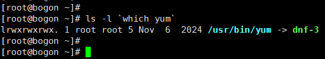
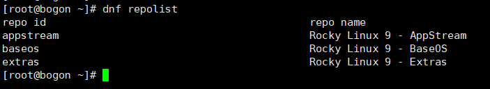
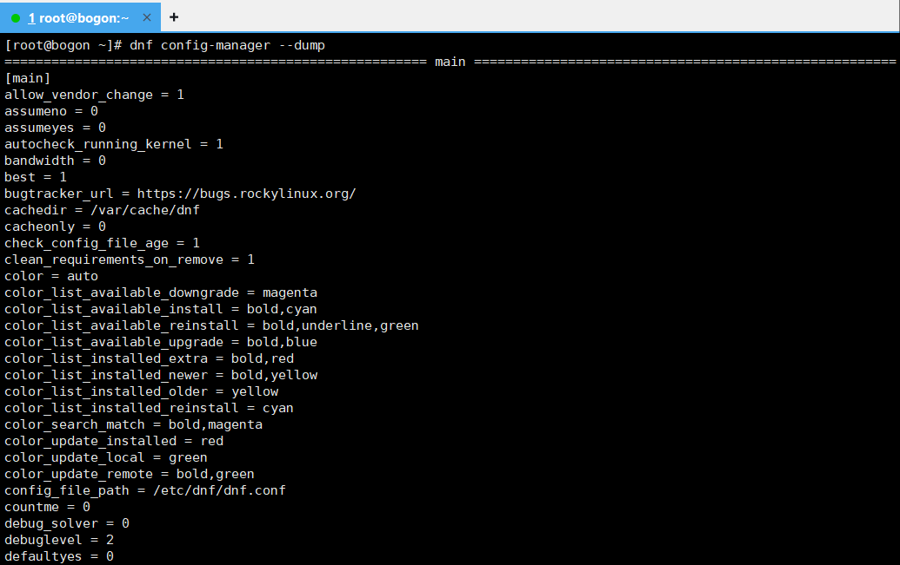
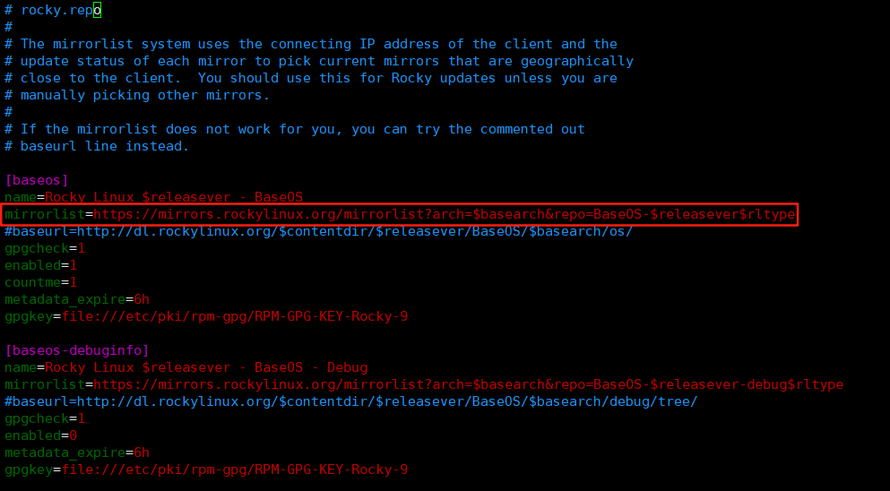
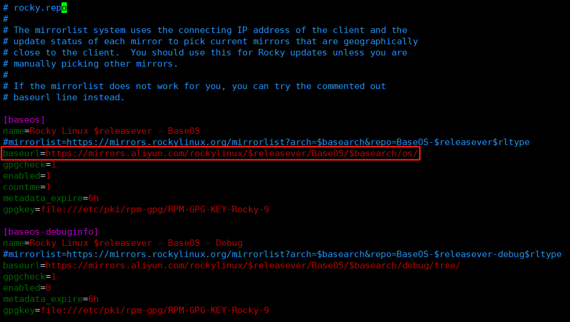
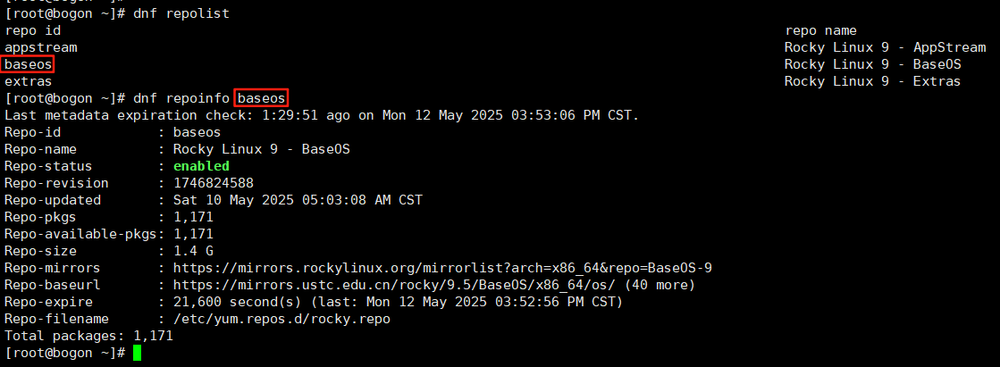
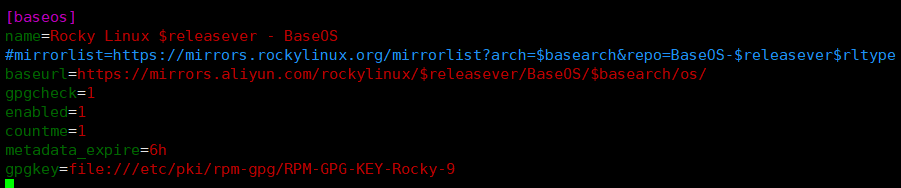
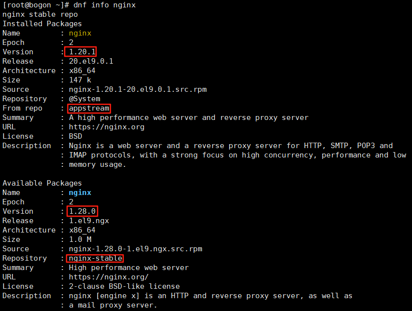

软件管理
========================
在Rocky 9/Redhat 9中，由 ``dnf`` 命令来管理软件。为了保持兼容性， ``dnf`` 的上一版本的命令 ``yum`` \
仍然可以使用，只不过 ``yum`` 是个软连接，指向 ``dnf`` 。



.. hint:: 

    ```command``` 是命令替换的语法，该语法可以将一个命令的输出作为另一个命令的参数。
    
    如 ``ls -l `which yum``` ，将 ``which yum`` 的输出作为 ``ls -l`` 的参数，等同于\
    先执行 ``which yum`` ，再用其结果执行 ``ls -l`` 。

    另一种写法为 ``ls -l $(which yum)`` ，效果同上。

软件仓库
------------------------
Linux中有成千上万个软件，它们并不是全部安装在系统中，而是按需安装。

这些软件按照不同的分类存放在不同的仓库中：



- BaseOS

  该仓库包含了系统基础功能的软件包，且发布时间比较早

- AppStream

  该仓库包含了额外的用户空间的应用、程序语言（如 ``golang`` ， ``php``）和数据库以用于各种用途

.. important:: 

    ``BaseOS`` 和 ``AppStream`` 是系统不可或缺的两个软件仓库，包装软件时必须包含这两个仓库，\
    否则在解决软件之间的依赖关系时会出现错误。

    这两个软件仓库都经由上游（即Redhat）验证，软件包的安全性和稳定性得到了保证。

- Extras

  该仓库提供了额外的功能性软件包，且不会破坏上游软件包的兼容性，但未经上游验证

- 其它仓库

  Rocky Linux还有其它软件仓库，它们默认状态是 ``disabled`` ，需要手动启用。

  .. image:: ../images/sysAdmin/9_dnf/1-3.png
    :align: center

  关于这些仓库的说明，可参见 `官方文档`_ 。

  .. _官方文档: https://wiki.rockylinux.org/rocky/repo/

dnf的配置
------------------------
``dnf`` 及相关工具的的配置位于 ``/etc/dnf/dnf.conf`` 文件中的 ``[main]`` 部分。

``/etc/dnf/dnf.conf`` 只包含了一部分被指定的配置，其它未被明确写入到这里的配置项，会\
使用默认值。

所有的配置项及其当前值可通过以下命令查看：

.. code:: shell

  dnf config-manager --dump


  
这些配置以键值对（等号左边为关键字或词key，等号右边为该关键字或词的值value）的形式存在，影响着 ``dnf`` 的行为。\
一般情况下无须修改这些配置，默认值就可以满足需求。

这些配置的作用可通过 ``man dnf.conf`` 命令查看，可按需修改配置并写入到 ``/etc/dnf/dnf.conf`` 文件中即可生效。

另一个值得关注的地方是 ``/etc/yum.repos.d/`` 目录，该目录下存放着所有的软件仓库配置文件。默认\
情况下， ``dnf`` 会从 ``mirrorlist`` 中选择离自己最近的mirror源站点 [#f1]_ ，下载软件包进行\
安装。



但有时候系统自动挑选的mirror源站点可能会比较慢，此时可以手动修改 ``/etc/yum.repos.d/`` 目录下的\
配置文件，将 ``mirrorlist`` 替换为 ``baseurl`` ，并指定一个更快的mirror源站点。

如将系统中的mirror地址指定为阿里云镜像站：

.. code:: shell

  sed -e 's|^mirrorlist=|#mirrorlist=|g' \
      -e 's|^#baseurl=http://dl.rockylinux.org/$contentdir|baseurl=https://mirrors.aliyun.com/rockylinux|g' \
      -i.bak \
      /etc/yum.repos.d/rocky*.repo

.. hint:: 

  ``sed`` 命令的作用与 ``vim`` 命令中的替换功能类似，但 ``sed`` 的替换功能更强大，\
  后续章节会详细介绍。

  上述命令中， ``-e`` 选项将 ``mirrorlist`` 添加注释符使其失效，同时将 ``baseurl`` 替换为\
  阿里云镜像站的地址； ``-i.bak`` 选项将替换后的内容写入到原文件中，并在原文件后添加一个备份文件。

  ``/etc/yum.repos.d/rocky*.repo`` 中的 ``*`` 是一个 `通配符`_ ，用来匹配 ``/etc/yum.repos.d/`` 目录下所有以\
  ``rocky`` 开头的文件。

  .. _通配符: https://baike.baidu.com/item/%E9%80%9A%E9%85%8D%E7%AC%A6/92991

  经此修改后， ``dnf`` 会从阿里云镜像站下载软件包进行安装。

修改后的配置文件如下：



在执行以下操作：

.. code:: shell

  # 删除系统已有的缓存文件
  dnf clean all
  # 重新生成缓存文件
  dnf makecache

软件搜索
------------------------
Linux软件仓库中有成千上万个软件包，如何快速搜索和查看自己需要的软件？

搜索软件包
^^^^^^^^^^^^^^^^^^^^^^^^^
``dnf`` 可以在所有的软件仓库中搜索自己需要的软件包：

- 搜索软件名或软件概要，如搜索 `nginx`_ ：

  .. _nginx: https://baike.baidu.com/item/Nginx/3817705

  .. code:: shell

    dnf search nginx

  .. image:: ../images/sysAdmin/9_dnf/1-5.png
    :align: center

- 在软件名、软件概要或软件描述中搜索，如搜索 ``nginx`` ：

  .. code:: shell

    dnf search --all nginx

  .. image:: ../images/sysAdmin/9_dnf/1-6.png
    :align: center

  .. note:: 

    使用 ``--all`` 选项进行搜索时，因为会在软件描述中额外进行搜索，因此速度会比正常搜索时慢。

- 搜索软件名并显示其名字与版本号，如搜索 ``nginx`` ：

  .. code:: shell

    dnf repoquery nginx

- 搜索哪个软件包提供了特定文件，如搜索 ``vim`` 文件由哪个软件包提供：

  .. code:: shell

    dnf provides vim

列出软件包
^^^^^^^^^^^^^^^^^^^^^^^^^
``dnf`` 可以列出所有的软件包，还可以对结果进行过滤，如只列出某个仓库的软件包、只列出可升级的软件包等。

- 列出所有的软件包：

  .. code:: shell

    dnf list --all

  .. image:: ../images/sysAdmin/9_dnf/1-7.png
    :align: center

  .. hint:: 

    由于 ``dnf list --all`` 输出的内容太多，因此可以使用管理符 ``|`` 将输出的结果\
    传递给 ``less`` 命令，再使用 ``less`` 命令查看输出的结果： ``dnf list --all | less`` 。

    ``@`` 开头的内容所在行，表示该软件包已经安装在系统上了。

- ``repoquery`` 命令也可以列出所有的软件包：

  .. code:: shell

    dnf repoquery

- 分类列出所有的软件包：

  对已经安装，可安装，可升级的软件包分别进行分类列出：

  - 列出所有的可安装的软件包：

    .. code:: shell

      dnf list --available

  - 列出所有的已安装的软件包：

    .. code:: shell

      dnf list --installed

  - 列出所有的可升级的软件包：

    .. code:: shell

      dnf list --upgrades

- 使用通配符进行过滤：

  .. code:: shell

    # 列出所有以 nginx 开头的软件包
    dnf list nginx*

查看软件仓库
^^^^^^^^^^^^^^^^^^^^^^^^^
``dnf`` 可以查看当前系统中已启用的软件仓库：

.. code:: shell

  dnf repolist

- 如果想查看禁用的仓库，可以使用 ``--disabled`` 选项：

  .. code:: shell

    dnf repolist --disabled

- 如果想查看所有的仓库，可以使用 ``--all`` 选项：

  .. code:: shell

      dnf repolist --all

同时，也可查看仓库的详细信息：

.. code:: shell

  # 查看 baseos 仓库的详细信息
  dnf repoinfo baseos



查看仓库时，可以使用通配符进行过滤，如查看所有以 ``app`` 开头的仓库：

.. code:: shell

  dnf repolist --all app*

显示软件包的详细信息
^^^^^^^^^^^^^^^^^^^^^^^^^
``dnf`` 可以通过查询仓库，来显示软件包的详细信息：

- 版本号
- 发布版本号
- `架构`_
- 软件包大小
- 软件包描述

.. _架构: https://baike.baidu.com/item/X86%E6%9E%B6%E6%9E%84

如查看 ``nginx`` 软件包的详细信息：

.. code:: shell

  dnf info nginx

已安装的软件包也可以使用 ``info`` 命令查看其详细信息：

.. code:: shell

  dnf info vim-enhanced

此处也可以使用通配符进行过滤，如查看所有以 ``nginx`` 开头的软件包的详细信息：

.. code:: shell

  dnf info nginx*

通过 ``repoquery`` 命令也可以查看软件包的详细信息，效果与 ``info`` 命令相同：

.. code:: shell

  dnf repoquery --info nginx

查看软件包组
^^^^^^^^^^^^^^^^^^^^^^^^^
软件包组由多个软件包组成，通过软件包组可以一步安装多个软件包。

- 列出已安装和可安装的软件包组：

  .. code:: shell

    dnf group list

  此处可使用 ``--installed`` 和 ``--available`` 选项进行过滤。如 ``dnf group list --installed`` \
  列出所有已安装的软件包组。
  
  ``--hidden`` 选项可以列出隐藏的软件包组。

- 查看软件包组内有哪些软件包，如查看 ``Server`` 组的软件包：

  .. code:: shell

    dnf group info Server

.. hint:: 

  ``Server`` 组是一个环境软件包组，它是由多个软件包组组成的，软件包组内又包含了多个软件包。

  如果软件包组的名称是由多个单词组成的，需要用引号括起来，如 ``dnf group info "Development Tools"`` 。

  此处也可以使用通配符进行过滤，如查看所有以 ``Server`` 开头的软件包组：

  .. code:: shell

    dnf group list Server*
  
  查看所有以 ``Server`` 开头的软件包组的软件包：

  .. code:: shell

      dnf group info Server*

软件安装
------------------------
在了解完自己需要的软件包后，就可以开始安装自己需要的软件包了。

安装软件
^^^^^^^^^^^^^^^^^^^^^^^^^^
软件安装有依赖关系，如安装a软件之前，b软件必须先安装，而b软件又依赖于c软件，c软件又依赖于d软件，\
依此类推。

``dnf`` 会自动解决这些依赖关系，安装软件时会自动安装所有依赖的软件包。

如安装 ``nginx`` ：

.. code:: shell

  dnf install nginx

也可同时安装多个软件包， ``-y`` 可以自动同意安装时的所有询问：

.. code:: shell

  dnf install -y nginx wget postfix

安装软件包组
^^^^^^^^^^^^^^^^^^^^^^^^^^
软件包组是由多个软件包组成的，通过软件包组可以一步安装多个软件包。

如安装 ``Standard`` 软件包组：

.. code:: shell

  dnf group install Standard

软件升级
------------------------
软件安装后，可能会有新版本的软件包发布，会有缺陷修复，或功能增强等。此时，可以使用 ``dnf`` 进行\
软件升级，且软件升级时会将软件依赖的软件包也一并升级。

检查更新
^^^^^^^^^^^^^^^^^^^^^^^^^^
检查系统上有哪些软件包可以升级：

.. code:: shell

  dnf check-update

该命令会列出可升级的软件包及其依赖软件包的升级版本。

升级软件
^^^^^^^^^^^^^^^^^^^^^^^^^^
可以升级单个软件包，也可以升级软件包组，或者升级所有可升级的软件包。

.. important:: 

  内核是一个非常重要的软件包，某些软件会与内核版本绑定，内核升级后，这些软件往往会出现问题，\
  因此升级内核时要注意此类问题。

  查看内核软件包： ``dnf info kernel`` 。

- 升级所有软件包：

  .. code:: shell

    dnf upgrade

- 升级单个软件包，如升级 ``nginx`` ：

  .. code:: shell

    dnf upgrade nginx

- 升级软件包组，如升级 ``Standard`` 软件包组：

  .. code:: shell

    dnf group upgrade Standard

.. hint:: 

  部分软件包可能需要重启系统才能生效，因为升级软件包后可视情况为系统做一次重启。

软件自动更新
------------------------------
软件升级也可以通过 ``dnf-automatic`` 来自动进行，它可用来检查更新以及执行以下操作：

- 只检查更新
- 检查并下载更新的软件包
- 检查、下载并安装更新的软件包

当执行完操作后，会根据配置的通知机制将结果通知给管理员，如email或log。

安装dnf-automatic
^^^^^^^^^^^^^^^^^^^^^^^^^^
可通过 ``dnf`` 直接安装 ``dnf-automatic`` ：

.. code:: shell

  dnf install dnf-automatic

确认 ``dnf-automatic`` 安装结果：

.. code:: shell

  rpm -qi dnf-automatic
  rpm -ql dnf-automatic

.. hint:: 

  ``rpm`` ：RPM Package Manager，是Redhat Linux及其衍生发行版中用于管理软件包的工具。\
  与 ``dnf`` 不同的是， ``rpm`` 需要手动下载软件包，然后再使用 ``rpm`` 命令进行安装，\
  而 ``dnf`` 可以自动下载软件包并安装。

  ``-q`` 选项用于查询软件包的信息， ``-i`` 选项用于显示软件包的安装信息， ``-l`` 选项用于\
  显示软件包的文件列表。

  更多信息可参见 ``man rpm`` 。

配置dnf-automatic
^^^^^^^^^^^^^^^^^^^^^^^^^^
``dnf-automatic`` 的配置文件位于 ``/etc/dnf/automatic.conf`` ，配置文件分为以下几个部分：

- ``[commands]``

  配置 ``dnf-automatic`` 要执行的操作，如更新类型，是否自动重启系统等。

- ``[emitters]``

  配置 ``dnf-automatic`` 如何通知管理员，如email、stdio和motd。

- ``[Email]``

  配置email通知的相关信息，如email地址、发信信息等。

- ``[command]``

  配置要执行的命令

- ``[command_email]``

  配置命令执行email通知

- ``[base]``

  此处可配置 ``dnf`` 的配置用来覆盖 ``/etc/dnf/dnf.conf`` 中的配置。

该文件可按说明修改，不改动使用默认配置也可直接使用。

启用自动更新
^^^^^^^^^^^^^^^^^^^^^^^^^^
``dnf-automatic`` 共有四个 ``timer unit`` ：

- ``dnf-automatic-download.timer`` ：只下载可用的软件包
- ``dnf-automatic-install.timer`` ： 下载并安装可用的软件包
- ``dnf-automatic-notifyonly.timer`` ： 只通知可用的安装包
- ``dnf-automatic.timer`` ： 下载、安装可用的软件包，或进行通知，取决于配置文件中的\
  ``download_updates`` 和 ``apply_updates`` 选项。

按需启用 ``timer unit`` 即可启用相关功能，如启用 ``dnf-automatic.timer`` ：

.. code:: shell

  systemctl enable --now dnf-automatic.timer
  # 查看timer状态
  systemctl status dnf-automatic.timer
  # 查看系统上所有的timer
  systemctl list-timers --all

软件卸载
------------------------
软件卸载使用 ``remove`` 来完成，用法与 ``install`` 命令相似。

如卸载多个软件：

.. code:: shell

  dnf remove nginx wget

卸载软件包组，如删除 ``Development Tools`` 软件包组：

.. code:: shell

  dnf group remove "Development Tools"

软件管理历史
------------------------
在软件安装、升级、卸载等操作时，系统都会记录相关的操作信息。通过 ``dnf history`` 命令可以查看\
以下信息：

- dnf的操作时间线
- 各个操作的日期和时间
- 每次操作受影响的软件数量
- 各个操作的结果，成功或取消
- 每次操作之间的软件包数据库的变化

甚至可以撤回之前的操作。

列出操作历史
^^^^^^^^^^^^^^^^^^^^^^^^^^
``dnf history`` 可以列出以下事项：

- 最新的操作记录

  .. code:: shell

    dnf history

  ``history`` 会显示所有的操作记录，有两个字段的信息值得关注：

  - ``Action(s)`` ：表示该条记录在当时执行了哪种操作，如安装（install,I）、升级（upgrade,U）、\
    卸载（remove,R）等。
  - ``Altered`` ：本次操作影响了多少个软件包。

  更详细的说明，可在 ``man dnf`` 中搜索 ``History`` 进行查看。

- 列出最近某个软件包的相关操作

  如查看 ``nginx`` 软件包的相关操作：

  .. code:: shell

    dnf history list nginx
  
- 列出某个操作的详细信息

  ``dnf history`` 列出的第一个字段为操作ID，可通过操作ID查看该操作的详细信信息，如查看\
  操作ID为1的详细信息：

  .. code:: shell

    dnf history info 1

dnf回退
^^^^^^^^^^^^^^^^^^^^^^^^^^
``dnf`` 可以回退到之前的某个操作，如此前安装了数个软件，可通过回退到之前的操作，来删除这些软件。

``dnf`` 有以下两种回退方式：

- 回退单个操作： ``dnf history undo``
- 从某个操作ID回退到之前的另一个操作ID： ``dnf history undo``

.. important:: 

  系统软件不支持回退，如 ``selinux`` 、 ``selinux-policy-*``、 ``kernel`` 和 ``glibc`` 以及\
  它们的依赖包等软件包不支持回退。

回退单个操作
""""""""""""""""""""""""

回退单个操作可以达到以下目的：

- 安装了一个软件包， ``undo`` 可以删除该软件包
- 卸载了一个软件包， ``undo`` 可以重新安装该软件包
- 升级了一个软件包， ``undo`` 可以回退到升级前的版本

接下来实操一下：

- 查看历史处理记录：

  .. code:: shell

    # dnf history list
    ID | Command line    | Date and time    | Action(s)      | Altered
    ----------------------------------------------------------------------- 
    75 | remove iotop    | 2025-05-26 16:53 | Removed        |    1   
    74 | install iotop   | 2025-05-26 16:53 | Install        |    1   

- ID为75的操作是删除了 ``iotop`` 软件包，我们可以使用 ``undo`` 来回退到该操作：

  .. code:: shell

    dnf history undo 75 

  此时， ``iotop`` 软件包会被重新发起安装。

- history记录中也会记录此次操作：

  .. code:: shell

    # dnf history list
    ID | Command line     | Date and time    | Action(s)      | Altered
    ----------------------------------------------------------------------
    76 | history undo 75  | 2025-05-26 17:04 | Install        |    1

.. hint:: 

  可依据自己系统内的history记录，来选择合适的操作ID进行回退，如先前安装的 ``nginx`` 。

  从新版本回退到旧版本，如果旧版本的安装包无法下载，回退将失败（镜像站点通常只提供新版本的软件包）。

回退多个操作
""""""""""""""""""""""""

``undo`` 是回退单个操作，而 ``rollback`` 是从最后一个操作ID到指定操作ID之间的所有操作都回退。

如下面的例子：

- 当前的操作历史记录：

  .. image:: ../images/sysAdmin/9_dnf/1-11.png
    :align: center

- 回退到ID为71的操作记录：

  .. image:: ../images/sysAdmin/9_dnf/1-12.png
    :align: center

  ``rollback`` 会将75到71之间的所有操作都回退，因此系统会提示是否要删除在此期间安装的所有软件包。

.. hint:: 

  ``undo`` 可以回退指定的单条操作，而 ``rollback`` 可以回退指定操作ID与最新操作ID之间的所有操作。

  但无论是 ``undo`` 还是 ``rollback`` ，都不能回退系统软件，如遇到涉及系统软件的回退操作，\
  会提示无法找到旧版本的软件包而失败。

管理软件仓库
------------------------
尽管系统自带的软件仓库已经足够丰富，但某些时候，我们需要安装的软件包可能不在系统自带的软件仓库中，\
此时，我们可以在系统中添加其它的软件仓库，来安装我们需要的软件包。

软件仓库的定义文件位于 ``/etc/yum.repos.d/`` 目录下，每个文件定义一个软件仓库，文件的后缀名\
为 ``.repo`` 。

软件仓库参数
^^^^^^^^^^^^^^^^^^^^^^^



软件仓库中的常用配置参数如下：

- ``[xxxx]`` ：软件仓库的ID，名称必须唯一，如 ``[baseos]`` 。
- ``name`` ：软件仓库的名称，如 ``Rocky Linux $releasever - BaseOS`` 。
- ``baseurl`` ：软件仓库的 `URL`_ 。
- ``mirrorlist`` ：软件仓库的镜像列表，该地址会返回一个镜像列表，供系统选择。
- ``gpgcheck`` ：是否检查软件仓库的GPG签名，检查软件仓库的GPG签名可以防止软件包被篡改，\
  1表示检查，0表示不检查。
- ``enabled`` ：是否启用该软件仓库，1表示启用，0表示禁用，可通过 ``dnf config-manager --enable/--disable`` 来启用或禁用软件仓库。
- ``countme`` ：是否添加特殊标识，1表示添加，0表示不添加，此参数方便软件仓库站点统计有多少系统在使用自己的软件仓库。
- ``metadata_expire`` ： `元数据`_ 过期时间，如6h表示6小时后过期。
- ``gpgkey`` ：软件仓库的GPG密钥位置，用于验证软件仓库的GPG签名。

  .. _URL: https://developer.mozilla.org/zh-CN/docs/Learn_web_development/Howto/Web_mechanics/What_is_a_URL
  .. _元数据: https://baike.baidu.com/item/%E5%85%83%E6%95%B0%E6%8D%AE/1946090

.. hint:: 

  更多参数可参见 ``man dnf.conf`` 中的 ``REPO OPTIONS`` 及以下的内容。

添加软件仓库
^^^^^^^^^^^^^^^^^^^^^^^
系统中自带的nginx软件版本较低，但nginx官方提供了最新版本的软件包，我们可以通过添加软件仓库，\
来安装最新版本的nginx。

按 `官方说明`_ ，在 ``/etc/yum.repos.d/`` 目录下创建 ``nginx.repo`` 文件，并添加如下内容：

.. _官方说明: https://nginx.org/en/linux_packages.html#RHEL

.. code:: shell

  # 创建nginx.repo文件
  vim /etc/yum.repos.d/nginx.repo
  # 添加以下内容
  [nginx-stable]
  name=nginx stable repo
  baseurl=http://nginx.org/packages/centos/$releasever/$basearch/
  gpgcheck=1
  enabled=1
  gpgkey=https://nginx.org/keys/nginx_signing.key
  module_hotfixes=true

  [nginx-mainline]
  name=nginx mainline repo
  baseurl=http://nginx.org/packages/mainline/centos/$releasever/$basearch/
  gpgcheck=1
  enabled=0
  gpgkey=https://nginx.org/keys/nginx_signing.key
  module_hotfixes=true

此时在查看nginx信息时，发现有更新的版本提供：



nginx共提供了两个版本的软件仓库，一个是稳定版，一个是主线版，我们可以通过启用或禁用软件仓库，\
来选择我们需要的版本。

默认启动用的稳定版本，可以切换到主线版本：

- 启用主线版本：

  .. code:: shell

    dnf config-manager --enable nginx-mainline

- 禁用稳定版本：

  .. code:: shell

    dnf config-manager --disable nginx-stable

- 安装最新版本的nginx：

  .. code:: shell

    # 此前如安装了nginx，需要先卸载
    dnf remove nginx
    # 安装最新版本的nginx
    dnf install nginx


.. rubric:: 脚注

.. [#f1] 开源软件通常会通过镜像站点（即与主网站中提供的下载内容一致）来分发软件包，以便减少\
    主站的下载压力；同时镜像站点会分布在世界各地，用户可以根据自己的地理位置选择离自己最近的\
    镜像站点进行下载，以提高下载速度。


    


