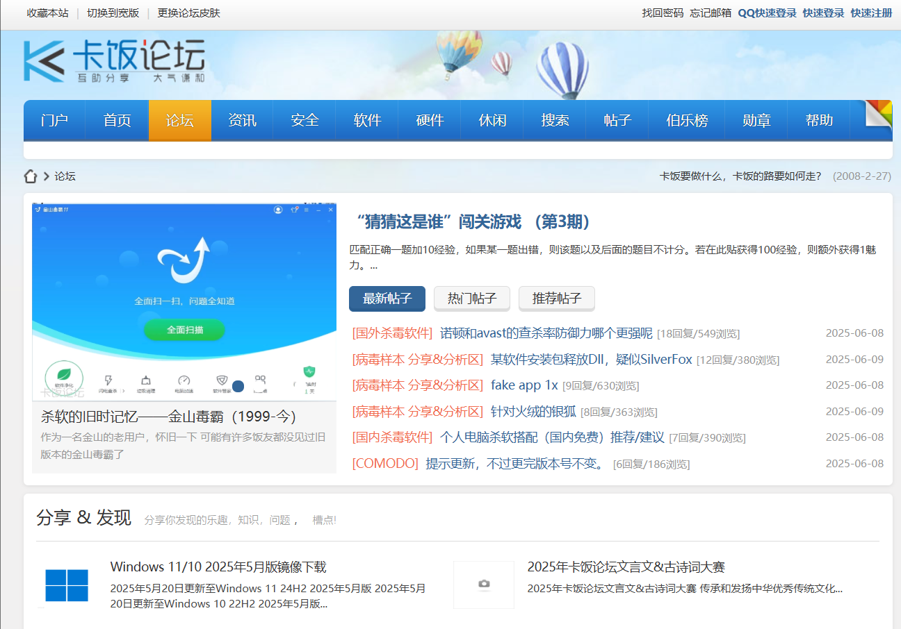

搭建论坛系统
============================
本教程到目前为止，已经介绍了绝大多数常用的系统基础管理操作，这些知识已经足够我们来搭建一些实用的系统了。\
比如来搭建一个论坛系统：

对于经常上网的“老网虫”来说，这种网站想必不陌生，而这种网站其实使用之前所学的知识，就可以轻松搭建。

.. important:: 

    在学习本章前，请确保已将本章之前的课程全部学习完成并理解其中的操作内容。

论坛系统环境
------------------------
国内常见的论坛，有很多是使用 `discuz`_ 来部署的，它是一个开源的论坛系统，功能强大，使用方便。

.. _discuz: https://www.discuz.vip/

discuz是使用PHP语言开发的，所以我们需要在虚拟机中部署PHP环境——LNMP：

- L： Linux操作系统
- N： Nginx网页服务器
- M： `MySQL`_ 数据库
- P： PHP编程语言

.. _MySQL: https://baike.baidu.com/item/mySQL/471251

切换安装版本
^^^^^^^^^^^^^^^^^^^^^^^
Nginx使用的是Nginx官方的repository仓库，它可以直接安装最新版本，而PHP和MySQL系统默认并不会提供\
最新版本，所以我们需要手动切换到较新的版本。同时，数据库并不直接使用MySQL，而是使用它的分支 `MariaDB`_ 。

.. _MariaDB: https://baike.baidu.com/item/mariaDB

- 检查Nginx的repository仓库是否已添加：

  .. image:: ../images/sysAdmin/10_lnmp/1-2.png
    :align: center

  该操作在 :ref:`add_repo` 中已经介绍过，所以不再赘述。

- 切换PHP版本到8.2：

  .. code:: bash

    # 查看系统中提供的PHP版本
    dnf module list php
    # 重置并切换到php:8.2的版本
    dnf module reset php
    dnf module enalbe php:8.2
    # 查看当前系统提供的PHP版本
    dnf info php

  .. image:: ../images/sysAdmin/10_lnmp/1-3.png
    :align: center

  .. hint:: 

    使用更新的8.3版本会出现一些问题，在写本教程的时间点，8.3版本的discuz无法正常运行，\
    所以我们选择使用8.2版本。

- 切换MariaDB版本：

  .. code:: bash

    # 查看系统中提供的MariaDB版本
    dnf module list mariadb
    # 重置并切换到最新版本
    dnf module reset mariadb
    dnf module enalbe mariadb:10.11
    # 查看当前系统提供的MariaDB服务器版本
    dnf info mariadb-server

  .. image:: ../images/sysAdmin/10_lnmp/1-4.png
    :align: center

- Linux操作系统：

  本教程使用的是Rocky Linux 9，以上操作均在该操作系统中进行，同时你应该随本章之前的教程进行了操作，\
  当前系统理论上已经是最新版本了。

安装LNMP
^^^^^^^^^^^^^^^^^^^^^^^
各个组件均切换到了最新版本，此时可以一并安装它们：

.. code:: bash

  dnf install php-fpm nginx mariadb-server

.. hint:: 

  `php-fpm`_ （FastCGI Process Manager）可实现额外的PHP特性，对于繁忙的网站来说，\
  可以提高PHP的运行效率，同时也可以提高网站的稳定性。

  .. _php-fpm: https://www.php.net/manual/zh/install.fpm.php

  mariadb-server是数据库服务端的软件包，而mariadb是客户端的软件包。

在安装完成后，需要对它们进行整合配置，以便后续部署discuz：

- 禁用SELinux与防火墙：

  SELinux和防火墙是系统安全的重要组成部分，但对于不熟悉它们的人来说，可能会造成一些麻烦。\
  所以我们先把它们禁用掉，以免对后续的操作造成干扰。

  .. code:: bash

    # 禁用SELinux
    setenforce 0
    # 禁用防火墙
    systemctl stop firewalld
    systemctl disable firewalld

  同时修改SELinux的配置文件，将其永久禁用：

  - 将 ``/etc/selinux/config`` 中的 ``SELINUX=enforcing`` 修改为 ``SELINUX=disabled`` ：

    .. image:: ../images/sysAdmin/10_lnmp/1-5.png
      :align: center

- 修改php-fpm的配置：

  php-fpm安装完成后，已经自动生成了一些配置文件，大部分的默认配置都可以直接使用，\
  只需要修改一下它的运行身份即可：

  - 将 ``/etc/php-fpm.d/www.conf`` 中的 ``user = apache`` 修改为 ``user = nginx`` ；\
    将 ``group = apache`` 修改为 ``group = nginx`` ：

    .. image:: ../images/sysAdmin/10_lnmp/1-6.png
      :align: center

    .. hint:: 

      php-fpm会与nginx一起运行，它们会协作处理PHP程序的运行，所以需要将php-fpm的运行身份\
      与nginx保持一致，这样才能保证它们之间的正常通信。

  其它配置文件不需要修改，保持默认即可。
  
  可查看 ``/etc/php-fpm.conf`` 和 ``/etc/php-fpm.d/www.conf`` 来了解php-fpm的配置项\
  以及它们的作用。

- 修改nginx的配置：

  php-fpm在安装时，生成了一个 ``/etc/nginx/default.d/php.conf`` 示例配置文件，它是\
  php-fpm和nginx结合的配置文件，我们需要将它配置到nginx中：

  1. 同时打开 ``/etc/nginx/default.d/php.conf`` 与 ``/etc/nginx/conf.d/default.conf`` \
     配置文件：

     .. code:: bash

      # 横向打开两个文件，以方便我们编辑
      vim -O /etc/nginx/conf.d/default.conf /etc/nginx/default.d/php.conf

  2. 按下ctrl+w键，然后按下l键，将光标移动到 ``/etc/nginx/conf.d/default.conf`` 文件中，\
     将光标移动到 ``location`` 处，按下 ``10yy`` 复制该处的内容。

  3. 按下ctrl+w键，然后按下h键，将光标移动到 ``/etc/nginx/default.d/php.conf`` 文件中，\
     将光标移动到 ``index  index.html index.htm;`` 处，按下 ``p`` 粘贴复制的内容。

  4. 输入 ``:set nu`` 开启行号显示：
     
     .. image:: ../images/sysAdmin/10_lnmp/1-7.png
       :align: center

  5. 输入 ``:10,19s@^@        @g``，将第10行到第19行的内容前面添加8个空格（两个 ``@`` 符号\
     之间是8个空格）：

     .. image:: ../images/sysAdmin/10_lnmp/1-8.png
       :align: center

  6. 将9行处的 ``index  index.html index.htm;`` 修改为 ``index  index.php index.html index.htm;`` \
     使其优先处理 ``index.php`` 文件：

     .. image:: ../images/sysAdmin/10_lnmp/1-9.png
      :align: center

  7. 输入 ``:wqa`` 保存并退出所有打开的文件

  nginx的配置文件位于 ``/etc/nginx/nginx.conf`` 和 ``/etc/nginx/conf.d/*.conf`` 中，\
  其中的配置参数含义可参考 `官方文档`_ 中的 `核心功能`_  和 `http核心模块`_ 来了解。

  .. _官方文档: https://nginx.org/en/docs/
  .. _核心功能: https://nginx.org/en/docs/ngx_core_module.html
  .. _http核心模块: https://nginx.org/en/docs/http/ngx_http_core_module.html

  .. image:: ../images/sysAdmin/10_lnmp/1-13.png
    :align: center

- 启动并测试PHP环境是否正常：

  php-fpm和nginx的配置文件一定要按上述步骤修改正确，否则服务会启动失败。

  启动php-fpm和nginx服务：

  .. code:: bash
    
    # 启动php-fpm和nginx服务
    systemctl start php-fpm nginx
    # 查看php-fpm和nginx服务的状态是否正常
    systemctl status php-fpm nginx
    # 设置开机启动php-fpm和nginx服务
    systemctl enable php-fpm nginx

  执行 ``vim /usr/share/nginx/html/phpinfo.php`` 创建测试文件，并写入以下内容：

  .. code:: php

    <?php
    phpinfo();
    ?>

  修改测试文件的属主和属组为nginx：

  .. code:: bash

    chown nginx:nginx /usr/share/nginx/html/phpinfo.php

  访问测试文件，查看PHP环境是否正常：

  - 使用浏览器访问虚拟机的地址加测试文件名，如笔者的虚拟机地址：
  
    .. image:: ../images/sysAdmin/10_lnmp/1-10.png
      :align: center

    因此，在浏览器中输入以下地址进行访问：

    .. image:: ../images/sysAdmin/10_lnmp/1-11.png
      :align: center

    此处应以自己的虚拟机地址为准。

  - 如果所有操作都正确，那么你应该在浏览器中看到如下的页面：

    .. image:: ../images/sysAdmin/10_lnmp/1-12.png
      :align: center

  如果出现了以上页面，那么说明PHP环境已经正常运行了。

- 启动并配置数据库MariaDB：

  数据库的配置不需要修改，默认配置已足够使用了，接下来需要启动数据库并进行简单配置：

  - 启动数据库服务：

    .. code:: bash

      # 设置开机启动数据库服务并使其立即启动
      systemctl enable mariadb --now
      # 查看数据库服务的状态是否正常
      systemctl status mariadb
  
  - 配置数据库：

    .. code:: bash

      mysql_secure_installation

    在出现交互界面时，可直接按下回车键，选择默认选项即可，其中进行到 ``Change the root password?`` \
    这一步时，需要为数据库的root用户设置密码（该用户密码非常重要，切勿忘记），其余选项均按回车选择默认即可。

  - 为论坛系统创建数据库和用户；

    可通过 ``mysql -A`` 直接登录数据库，执行以下指令创建论坛系统数据库和用户：

    .. code:: sql

      --创建数据库discuz
      CREATE DATABASE discuz;
      --创建用户discuz并设置密码为discuz同时赋予该用户discuz数据库的所有权限
      GRANT ALL PRIVILEGES ON discuz.* TO 'discuz'@'localhost' IDENTIFIED BY 'discuz';

    以上步骤均提示 ``Query OK, xxxx`` 表示操作成功，执行 ``exit`` 即可退出数据库。

    .. hint:: 

      数据库是比较重要的系统，可通过 `MariaDB官方文档`_ 来了解更多信息。

      笔者也为数据库写了一套 `教程`_ ，有兴趣的读者可以参考学习。

      .. _MariaDB官方文档: https://mariadb.com/docs/
      .. _教程: https://mariadb-tutorial.readthedocs.io/zh-cn/latest/

部署论坛系统
-------------------------
在一切准备妥当之后，我们就可以开始部署discuz论坛了。

- 下载discuz部署包：

  .. code:: bash

    # /usr/local/src常用来放置软件源码包，因此我们将discuz部署包下载到该目录
    cd /usr/local/src/
    # 使用wget命令下载，没有安装wget的话可以使用dnf安装
    wget -O discuz.zip https://gitee.com/Discuz/DiscuzX/attach_files/2044572/download
    # 解压discuz部署包
    unzip discuz.zip -d discuz

  也可以通过 `discuz官网下载`_ ：

  .. _discuz官网下载: https://www.discuz.vip/download
  
  .. image:: ../images/sysAdmin/10_lnmp/1-14.png
    :align: center

  然后通过Xshell的文件传输功能将下载好的部署包上传到虚拟机中，再解压即可。

  .. image:: ../images/sysAdmin/10_lnmp/1-15.png
    :align: center

- 将论坛系统文件复制到nginx的根目录：

  .. code:: bash

    # 将upload目录下的所有文件复制到nginx的web根目录下
    cp -r discuz/upload/* /usr/share/nginx/html/
    # 修改nginx的web根目录的属主和属组为nginx
    chown -R nginx:nginx /usr/share/nginx/html/*

- 访问论坛系统，进行初始化设置：

  直接在浏览器中访问虚拟机的地址，将出现如下的页面：

  .. image:: ../images/sysAdmin/10_lnmp/1-16.png
    :align: center

  点击 **同意** 后，系统出现报错：

  .. image:: ../images/sysAdmin/10_lnmp/1-17.png
    :align: center

  这表明当前的PHP环境中缺少图中的模块，不过这解决起来也很容易：

  .. code:: bash

    # 搜索缺少的模块
    dnf search php-mysql
    dnf search php-xml
    # 根据搜索结果，安装缺少的模块
    dnf install php-mysqlnd php-xml
    # 重启php-fpm
    systemctl restart php-fpm

  安装完缺少的模块后，刷新页面，即可看到已经满足所有要求，可以继续下一步了：

  .. image:: ../images/sysAdmin/10_lnmp/1-18.png
    :align: center

  点击 **下一步** 后，保持默认选项不变，继续点击 **下一步** ：

  .. image:: ../images/sysAdmin/10_lnmp/1-19.png
    :align: center

  这里要求填写数据库信息，直接将先前创建好的数据库与用户信息填入即可，其它信息可不修改：

  .. image:: ../images/sysAdmin/10_lnmp/1-20.png
    :align: center

  .. important:: 

    数据库中保存着非常重要的数据信息，实际使用环境中请不要设置这么随便的密码，此处仅为演示。

  别忘记在 **填写管理员信息** 中设置一个密码，其它信息可不修改，然后点击 **下一步** 。\
  如果你的步骤都没有问题，页面会显示开始数据库初始化，在结束后会出现如下的页面：

  .. image:: ../images/sysAdmin/10_lnmp/1-21.png
    :align: center

  到此，论坛系统的部署就已经完成了，点击 **直接访问站点** 即可看到熟悉的论坛页面：

  .. image:: ../images/sysAdmin/10_lnmp/1-22.png
    :align: center

  可尽情探索discuz中的各个功能，这里就不过多介绍了。

  .. hint:: 

    discuz的管理后台会提示如下信息：

    .. image:: ../images/sysAdmin/10_lnmp/1-23.png
      :align: center

    同样可以直接搜索并安装该模块：

    .. code:: bash

      dnf search php-gd
      dnf install php-gd
      # 重启php-fpm
      systemctl restart php-fpm

    同时安装opcache，提升PHP的运行效率：

    .. code:: bash

      dnf install php-opcache
      # 重启php-fpm
      systemctl restart php-fpm

仅仅学习了基础的Linux知识，就可以搭建一个如此强大的论坛系统，Linux能做的事情远不止于此。

.. hint::

    本教程中涉及到的所有操作均在虚拟机中进行，实际使用环境中请根据自己的实际情况进行操作。
